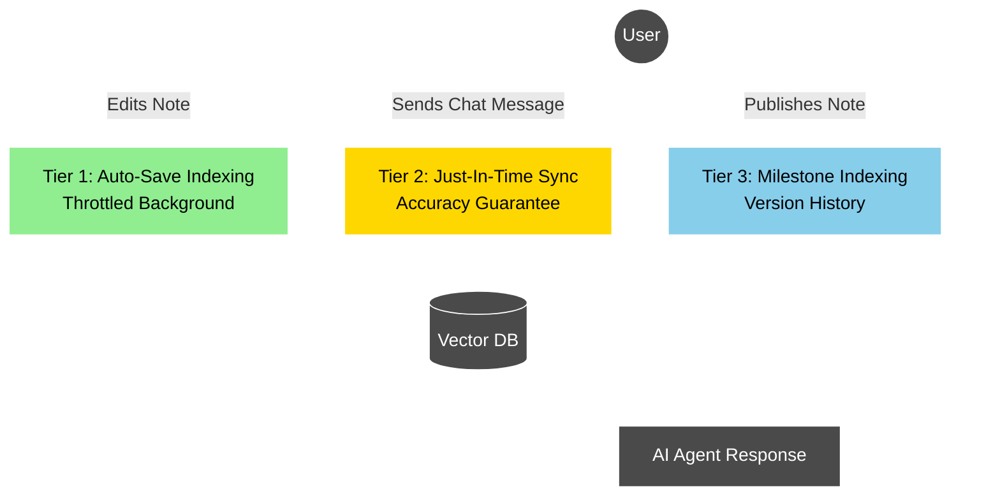

# Intent-Based Draft Indexing Plan

## Overview

This plan decouples the "Publishing" concept from the "Indexing" concept to enable AI chat features to work seamlessly with unpublished draft notes. The current architecture only creates embeddings when a note is published, which creates a confusing user experience where the AI cannot see recently created or edited notes.

The solution implements a multi-trigger indexing strategy that keeps embeddings fresh without excessive API costs.

## Problem Statement

**Current Behavior:**

- Embeddings are only created when a user explicitly "publishes" a note version
- The chat scope filters for `is_published: true` when building the context
- Users cannot chat with unpublished notes, even if they contain critical information
- This creates a "blind spot" where the AI cannot see recent work

**User Impact:**

- Confusing experience: "Why can't the AI see the note I just created?"
- Workflow friction: Users must remember to publish notes before chatting
- Missed context: Critical information in drafts is invisible to the AI

## Solution: Simplified 3-Tier Indexing Strategy

Implement a streamlined three-tier indexing strategy that balances cost, performance, and user experience without unnecessary complexity.

### Architecture Diagram



### Indexing Tiers

| Tier                | Trigger                    | Logic                                                                          | Purpose                                           |
| ------------------- | -------------------------- | ------------------------------------------------------------------------------ | ------------------------------------------------- |
| **1. Auto-Save**    | `updateNoteVersionContent` | `(now - last_indexed_at > 10m)` OR `(abs(length - last_indexed_length) > 500)` | Periodic background updates during active editing |
| **2. Just-In-Time** | `sendChat` execution       | `updated_at > last_indexed_at`                                                 | Guarantee 100% freshness before AI response       |
| **3. Milestone**    | Explicit publish action    | Always runs                                                                    | Create permanent versioned index                  |

## Implementation Steps

### 1. Database Schema Changes

**File:** [`prisma/schema.prisma`](prisma/schema.prisma)

Add tracking fields to `note_version`:

```prisma
model note_version {
  // ... existing fields
  last_indexed_at         DateTime? @db.Timestamptz(3)
  last_indexed_char_count Int?      @default(0)
}
```

**Migration:**

```bash
npx prisma migrate dev --name add_indexing_tracking
```

### 2. Update Note Service (Tier 1: Auto-Save Indexing)

**File:** [`services/note/noteService.ts`](services/note/noteService.ts:417)

Modify `updateNoteVersionContent` to include conditional indexing:

```typescript
public updateNoteVersionContent = withErrorHandling(
  async (params: {
    versionId: string;
    richTextContent: any;
    userId: string;
  }): Promise<UpdateNoteVersionContentResponse> => {
    const validatedData = updateNoteVersionContentSchema.parse(params);
    const { versionId, richTextContent, userId } = validatedData;

    // Verify the note version exists and belongs to the user
    const noteVersion = await prisma.note_version.findFirst({
      where: {
        id: versionId,
        note: {
          user_id: userId,
          is_deleted: false,
        },
      },
    });

    if (!noteVersion) {
      throw new NotFoundError("Note version not found or access denied");
    }

    // Extract plain text from rich text content
    const plainTextContent = RichTextExtractor.extractPlainText(richTextContent);
    const extractedTitle = RichTextExtractor.extractTitle(richTextContent);

    // Check if indexing is needed (Tier 1: Auto-Save)
    const INDEXING_COOLDOWN = 10 * 60 * 1000; // 10 minutes
    const SIGNIFICANT_CHANGE_THRESHOLD = 500; // characters

    const timeSinceLastIndex = noteVersion.last_indexed_at
      ? Date.now() - noteVersion.last_indexed_at.getTime()
      : Infinity;

    const charCountDelta = Math.abs(
      plainTextContent.length - (noteVersion.last_indexed_char_count || 0)
    );

    const shouldIndex =
      !noteVersion.last_indexed_at ||
      timeSinceLastIndex > INDEXING_COOLDOWN ||
      charCountDelta > SIGNIFICANT_CHANGE_THRESHOLD;

    // Execute all operations in a transaction
    const result = await prisma.$transaction(async (tx) => {
      // Update the note title
      const updatedNote = await tx.note.update({
        where: { id: noteVersion.note_id },
        data: { title: extractedTitle },
        select: { id: true, title: true },
      });

      // Save the version content
      const savedVersion = await tx.note_version.update({
        where: { id: versionId },
        data: {
          rich_text_content: richTextContent,
          plain_text_content: plainTextContent,
        },
      });

      // Conditionally index if needed
      if (shouldIndex) {
        const aiService = new AiService(userId);

        // Delete old chunks
        await aiService.deleteEmbeddingsForVersion(versionId, tx);

        // Create new chunks
        await aiService.createEmbeddedChunksForVersion(
          versionId,
          extractedTitle,
          plainTextContent,
          tx
        );

        // Update tracking fields
        await tx.note_version.update({
          where: { id: versionId },
          data: {
            last_indexed_at: new Date(),
            last_indexed_char_count: plainTextContent.length,
          },
        });
      }

      return {
        version: savedVersion,
        note: updatedNote,
      };
    });

    return result;
  }
);
```

### 3. Update Chat Service (Tier 2: Just-In-Time Sync)

**File:** [`services/chat/chatService.ts`](services/chat/chatService.ts:68)

#### 3a. Update `createChatScope` to use current versions

Change the version selection logic to use `current_version_id` instead of filtering by `is_published`:

```typescript
public createChatScope = withErrorHandling(
  async (params: {
    userId: string;
    scope: ChatScope;
    noteId?: string;
    folderId?: string;
  }): Promise<ChatScopeObject> => {
    const validatedData = createChatScopeSchema.parse(params);

    const chatScope: ChatScopeObject = {
      scope: validatedData.scope,
      scopeId: validatedData.noteId || validatedData.folderId || null,
      noteVersions: [],
    };

    // 1 - scope is note - get the current version (draft or published)
    if (chatScope.scope === "note" && chatScope.scopeId) {
      const note = await prisma.note.findFirst({
        where: {
          id: chatScope.scopeId,
          user_id: validatedData.userId,
          is_deleted: false,
        },
        select: {
          id: true,
          current_version_id: true,
        },
      });

      if (note && note.current_version_id) {
        chatScope.noteVersions.push({
          noteId: note.id,
          versionId: note.current_version_id,
        });
      }
    }

    // 2 - scope is folder - get current version of each note
    if (chatScope.scope === "folder" && chatScope.scopeId) {
      const notes = await prisma.note.findMany({
        where: {
          user_id: validatedData.userId,
          folder_id: chatScope.scopeId,
          is_deleted: false,
        },
        select: {
          id: true,
          current_version_id: true,
        },
      });

      notes.forEach((note) => {
        if (note.current_version_id) {
          chatScope.noteVersions.push({
            noteId: note.id,
            versionId: note.current_version_id,
          });
        }
      });
    }

    // 3 - scope is global - get current version of all notes
    if (chatScope.scope === "global" && !chatScope.scopeId) {
      const notes = await prisma.note.findMany({
        where: {
          user_id: validatedData.userId,
          is_deleted: false,
        },
        select: {
          id: true,
          current_version_id: true,
        },
      });

      notes.forEach((note) => {
        if (note.current_version_id) {
          chatScope.noteVersions.push({
            noteId: note.id,
            versionId: note.current_version_id,
          });
        }
      });
    }

    return chatScope;
  }
);
```

#### 3b. Add just-in-time sync in `sendChat`

Add a helper method to ensure scope freshness and call it before agent execution:

```typescript
/**
 * Ensure all notes in scope have fresh embeddings (Tier 2: Just-In-Time)
 * This guarantees 100% accuracy by syncing stale versions before agent execution
 * Uses parallel processing to minimize latency for large scopes
 */
private ensureScopeIsFresh = withErrorHandling(
  async (params: {
    userId: string;
    chatScope: ChatScopeObject;
  }): Promise<void> => {
    const { userId, chatScope } = params;

    if (chatScope.noteVersions.length === 0) return;

    const versionIds = chatScope.noteVersions.map(v => v.versionId);

    // Find versions that need syncing
    const staleVersions = await prisma.note_version.findMany({
      where: {
        id: { in: versionIds },
        OR: [
          { last_indexed_at: null },
          {
            updated_at: {
              gt: prisma.note_version.fields.last_indexed_at,
            },
          },
        ],
      },
      include: {
        note: {
          select: {
            title: true,
          },
        },
      },
    });

    if (staleVersions.length === 0) return;

    // Log warning if many stale versions (potential performance issue)
    if (staleVersions.length > 20) {
      console.warn(
        `[ensureScopeIsFresh] Syncing ${staleVersions.length} stale versions. Consider running auto-save more frequently.`
      );
    }

    // Sync all stale versions in parallel using Promise.all
    const aiService = new AiService(userId);

    await Promise.all(
      staleVersions.map(async (version) => {
        try {
          await prisma.$transaction(async (tx) => {
            // Delete old embeddings
            await aiService.deleteEmbeddingsForVersion(version.id, tx);

            // Create new embeddings
            await aiService.createEmbeddedChunksForVersion(
              version.id,
              version.note.title,
              version.plain_text_content,
              tx
            );

            // Update tracking fields
            await tx.note_version.update({
              where: { id: version.id },
              data: {
                last_indexed_at: new Date(),
                last_indexed_char_count: version.plain_text_content.length,
              },
            });
          });
        } catch (error) {
          // Log error but don't fail the entire operation
          console.error(
            `[ensureScopeIsFresh] Failed to sync version ${version.id}:`,
            error
          );
          // Re-throw to let Promise.all catch it
          throw error;
        }
      })
    );
  }
);

// Update sendChat to call the safety net
public sendChat = withErrorHandling(
  async (params: {
    userId: string;
    message: string;
    scope: ChatScope;
    noteId?: string;
    folderId?: string;
    sessionId?: string;
  }): Promise<SendChatResponse> => {
    // ... existing validation and setup ...

    const currentChatScope = await this.createChatScope({
      userId: validatedUserId,
      scope: validatedScope,
      noteId: validatedNoteId,
      folderId: validatedFolderId,
    });

    // TIER 2: Just-in-time sync - ensure scope is fresh before creating agent
    await this.ensureScopeIsFresh({
      userId: validatedUserId,
      chatScope: currentChatScope,
    });

    // ... rest of existing sendChat logic ...
  }
);
```

### 4. Update AI Tools

**File:** [`services/ai/agents/tools/getNotesTool.ts`](services/ai/agents/tools/getNotesTool.ts:45)

Remove the `is_published: true` filter:

```typescript
const getNoteVersionsForScope = async (
  userId: string,
  chatScope: ChatScopeObject,
): Promise<(PrismaNoteVersion & { note: PrismaNote })[]> => {
  const versionIds = chatScope.noteVersions.map((version) => version.versionId);
  const noteContent = await prisma.note_version.findMany({
    where: {
      id: {
        in: versionIds,
      },
      note: {
        user_id: userId,
        is_deleted: false,
      },
      // REMOVED: is_published: true
    },
    include: {
      note: true,
    },
  });
  return noteContent;
};
```

### 5. Update Publish Indexing (Tier 3: Milestone)

**File:** [`services/note/noteService.ts`](services/note/noteService.ts:714)

The existing `publishNoteVersion` method already handles embedding creation. Ensure it also updates the tracking fields:

```typescript
// Inside publishNoteVersion transaction
await tx.note_version.update({
  where: { id: validatedVersionId },
  data: {
    is_published: true,
    published_at: new Date(),
    last_indexed_at: new Date(), // ADD THIS
    last_indexed_char_count: plainTextContent.length, // ADD THIS
  },
});
```

## Testing Plan

### Unit Tests

1. **Auto-Save Indexing**

   - Test that indexing triggers after 10 minutes
   - Test that indexing triggers after 500 character change
   - Test that indexing does NOT trigger within cooldown period with small changes

2. **Just-In-Time Sync**
   - Test that `ensureScopeIsFresh` syncs stale versions
   - Test that it skips already-fresh versions
   - Test that it handles empty scopes gracefully
   - Test that it correctly identifies versions needing sync

### Integration Tests

1. **End-to-End Chat Flow**

   - Create a note, don't publish
   - Send chat message, verify just-in-time sync triggers
   - Verify AI can see the draft content
   - Verify response includes information from the draft

2. **Multi-Note Folder**

   - Create folder with 5 notes (3 published, 2 drafts)
   - Chat with folder scope
   - Verify AI can see all 5 notes

3. **Performance & Parallelization**
   - Test with 50+ notes in a folder
   - Verify parallel sync completes within reasonable time
   - Test with 100+ stale notes in global scope
   - Verify `Promise.all` processes embeddings in parallel
   - Verify no duplicate embedding creation
   - Measure latency improvement from parallel processing

## Cost Analysis

### Current State

- Embeddings only on publish: ~1 embedding per note per publish event
- Cost: $0.02 per 1M tokens

### New State

- Auto-save: Max 6 embeddings/hour per actively edited note
- Just-in-time: 1 embedding per chat session (only if stale)
- Publish: 1 embedding (same as before)

**Example Scenario:**

- User actively edits 5 notes for 1 hour, then chats 3 times
- Each note averages 1,000 words (~1,500 tokens)
- Auto-save embeddings: 5 notes × 6 syncs/hour = 30 embeddings
- Just-in-time embeddings: ~3 embeddings (if any notes are stale)
- Total tokens: 33 × 1,500 = 49,500 tokens
- Cost: $0.001 per hour of active editing + chatting

**Conclusion:** The cost increase is negligible (~$0.001/hour) while dramatically improving UX.

## Rollout Strategy

### Phase 1: Core Decoupling (Week 1)

1. Add database fields (`last_indexed_at`, `last_indexed_char_count`)
2. Update `createChatScope` to use `current_version_id` instead of `is_published: true`
3. Implement `ensureScopeIsFresh` method in ChatService
4. Update `sendChat` to call just-in-time sync
5. Update `getNotesTool` to remove `is_published: true` filter

### Phase 2: Auto-Save Indexing (Week 2)

1. Update `updateNoteVersionContent` with conditional indexing logic
2. Update `publishNoteVersion` to set tracking fields
3. Add logging for embedding operations

### Phase 3: Testing & Optimization (Week 2-3)

1. Run integration tests
2. Monitor embedding API costs
3. Gather user feedback
4. Adjust cooldown timings if needed

## Success Metrics

1. **User Experience**

   - Zero "AI can't see my note" support tickets
   - Reduced time between note creation and first chat

2. **Performance**

   - Chat response time remains under 5 seconds for typical scopes (1-10 notes)
   - Just-in-time sync adds minimal latency (<500ms for 1-2 stale notes)
   - Parallel processing handles 20+ stale notes efficiently (<2 seconds)
   - Global scope with 100+ stale notes completes within acceptable time (<10 seconds)

3. **Cost**
   - Embedding API costs increase by less than 20%
   - Cost per active user remains under $0.10/month

## Performance Considerations

### Parallel Processing Strategy

The `ensureScopeIsFresh` method uses `Promise.all` to process multiple stale versions in parallel:

**Benefits:**

- ✅ Dramatically reduces latency for large scopes
- ✅ 10 stale notes: ~1-2 seconds (vs. 10-20 seconds sequential)
- ✅ 100 stale notes: ~5-10 seconds (vs. 100-200 seconds sequential)

**Trade-offs:**

- ⚠️ Higher concurrent load on OpenAI API (rate limits may apply)
- ⚠️ Higher memory usage during parallel processing
- ⚠️ Database connection pool usage increases

### Rate Limiting Safeguards

If you encounter OpenAI rate limits with parallel processing, consider:

1. **Batch Size Limiting**: Process in chunks of 10-20 at a time
2. **Progressive Enhancement**: Start with sequential, upgrade to parallel for Pro users
3. **Background Processing**: For global scope, sync in background and notify user when ready

### Example: Chunked Parallel Processing

```typescript
// Process in batches of 10 to avoid rate limits
const BATCH_SIZE = 10;
for (let i = 0; i < staleVersions.length; i += BATCH_SIZE) {
  const batch = staleVersions.slice(i, i + BATCH_SIZE);
  await Promise.all(
    batch.map(async (version) => {
      // ... sync logic
    }),
  );
}
```

## Future Enhancements

1. **Smart Cooldown Adjustment**

   - Learn user patterns and adjust cooldown dynamically
   - More frequent syncing for "active" notes, less for "stable" notes

2. **Batch Optimization**

   - Batch multiple note embeddings into single OpenAI API call
   - Reduce overhead and cost for large folder syncs

3. **Background Sync for Global Scope**

   - For global scope with 50+ stale notes, sync in background
   - Show progress indicator and allow chat once minimum threshold is met
   - "Syncing 47 notes... You can start chatting now, more context will be added as sync completes"

4. **User Preferences**

   - Allow users to configure sync frequency
   - Option to disable auto-sync for cost-conscious users

5. **Analytics Dashboard**
   - Show users their embedding usage
   - Visualize which notes are most frequently synced
   - Alert users if they have many stale notes
