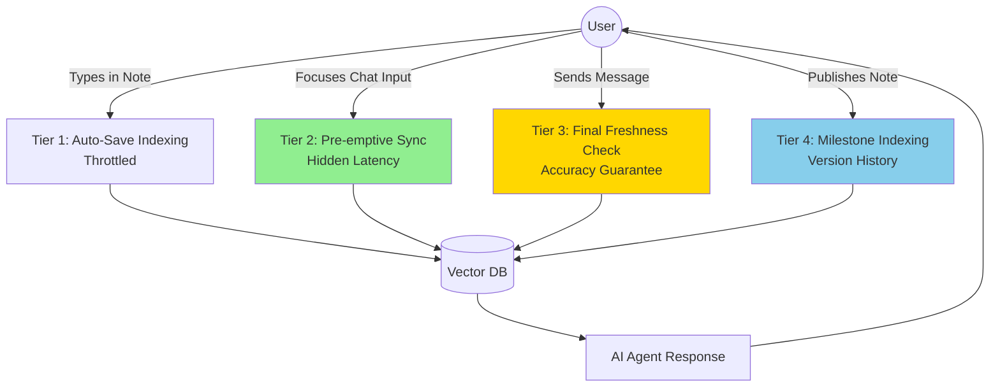

# Intent-Based Draft Indexing Plan

## Overview

This plan decouples the "Publishing" concept from the "Indexing" concept to enable AI chat features to work seamlessly with unpublished draft notes. The current architecture only creates embeddings when a note is published, which creates a confusing user experience where the AI cannot see recently created or edited notes.

The solution implements a multi-trigger indexing strategy that keeps embeddings fresh without excessive API costs.

## Problem Statement

**Current Behavior:**

- Embeddings are only created when a user explicitly "publishes" a note version
- The chat scope filters for `is_published: true` when building the context
- Users cannot chat with unpublished notes, even if they contain critical information
- This creates a "blind spot" where the AI cannot see recent work

**User Impact:**

- Confusing experience: "Why can't the AI see the note I just created?"
- Workflow friction: Users must remember to publish notes before chatting
- Missed context: Critical information in drafts is invisible to the AI

## Solution: Intent-Based Indexing

Implement a three-tier indexing strategy that balances cost, performance, and user experience.

### Architecture Diagram



### Indexing Tiers

| Tier               | Trigger                    | Logic                                                                          | Purpose                                           |
| ------------------ | -------------------------- | ------------------------------------------------------------------------------ | ------------------------------------------------- |
| **1. Auto-Save**   | `updateNoteVersionContent` | `(now - last_indexed_at > 10m)` OR `(abs(length - last_indexed_length) > 500)` | Periodic background updates during active editing |
| **2. Pre-emptive** | Chat input focus/typing    | `updated_at > last_indexed_at`                                                 | Mask latency by syncing while user composes query |
| **3. Safety Net**  | `sendChat` execution       | `updated_at > last_indexed_at`                                                 | Guarantee 100% freshness before AI response       |
| **4. Milestone**   | Explicit publish action    | Always runs                                                                    | Create permanent versioned index                  |

## Implementation Steps

### 1. Database Schema Changes

**File:** [`prisma/schema.prisma`](prisma/schema.prisma)

Add tracking fields to `note_version`:

```prisma
model note_version {
  // ... existing fields
  last_indexed_at         DateTime? @db.Timestamptz(3)
  last_indexed_char_count Int?      @default(0)
}
```

**Migration:**

```bash
npx prisma migrate dev --name add_indexing_tracking
```

### 2. Update Note Service (Tier 1: Auto-Save)

**File:** [`services/note/noteService.ts`](services/note/noteService.ts:417)

Modify `updateNoteVersionContent` to include conditional indexing:

```typescript
public updateNoteVersionContent = withErrorHandling(
  async (params: {
    versionId: string;
    richTextContent: any;
    userId: string;
  }): Promise<UpdateNoteVersionContentResponse> => {
    const validatedData = updateNoteVersionContentSchema.parse(params);
    const { versionId, richTextContent, userId } = validatedData;

    // Verify the note version exists and belongs to the user
    const noteVersion = await prisma.note_version.findFirst({
      where: {
        id: versionId,
        note: {
          user_id: userId,
          is_deleted: false,
        },
      },
    });

    if (!noteVersion) {
      throw new NotFoundError("Note version not found or access denied");
    }

    // Extract plain text from rich text content
    const plainTextContent = RichTextExtractor.extractPlainText(richTextContent);
    const extractedTitle = RichTextExtractor.extractTitle(richTextContent);

    // Check if indexing is needed
    const INDEXING_COOLDOWN = 10 * 60 * 1000; // 10 minutes
    const SIGNIFICANT_CHANGE_THRESHOLD = 500; // characters

    const timeSinceLastIndex = noteVersion.last_indexed_at
      ? Date.now() - noteVersion.last_indexed_at.getTime()
      : Infinity;

    const charCountDelta = Math.abs(
      plainTextContent.length - (noteVersion.last_indexed_char_count || 0)
    );

    const shouldIndex =
      !noteVersion.last_indexed_at ||
      timeSinceLastIndex > INDEXING_COOLDOWN ||
      charCountDelta > SIGNIFICANT_CHANGE_THRESHOLD;

    // Execute all operations in a transaction
    const result = await prisma.$transaction(async (tx) => {
      // Update the note title
      const updatedNote = await tx.note.update({
        where: { id: noteVersion.note_id },
        data: { title: extractedTitle },
        select: { id: true, title: true },
      });

      // Save the version content
      const savedVersion = await tx.note_version.update({
        where: { id: versionId },
        data: {
          rich_text_content: richTextContent,
          plain_text_content: plainTextContent,
        },
      });

      // Conditionally index if needed
      if (shouldIndex) {
        const aiService = new AiService(userId);

        // Delete old chunks
        await aiService.deleteEmbeddingsForVersion(versionId, tx);

        // Create new chunks
        await aiService.createEmbeddedChunksForVersion(
          versionId,
          extractedTitle,
          plainTextContent,
          tx
        );

        // Update tracking fields
        await tx.note_version.update({
          where: { id: versionId },
          data: {
            last_indexed_at: new Date(),
            last_indexed_char_count: plainTextContent.length,
          },
        });
      }

      return {
        version: savedVersion,
        note: updatedNote,
      };
    });

    return result;
  }
);
```

### 3. Create Sync Endpoint (Tier 2: Pre-emptive)

**File:** `app/api/notes/sync-scope/route.ts` (new file)

```typescript
import { withApiErrorHandling } from "@/lib/errors/apiRouteHandlers";
import { getDbUser } from "@/lib/getDbUser";
import { auth } from "@clerk/nextjs/server";
import { NextRequest, NextResponse } from "next/server";
import { prisma } from "@/lib/prisma";
import { AiService } from "@/services/ai/aiService";
import { z } from "zod";

const syncScopeSchema = z.object({
  scope: z.enum(["note", "folder", "global"]),
  scopeId: z.string().uuid().optional(),
});

/**
 * Pre-emptively sync embeddings for notes in the current scope
 * Called when user focuses chat input to mask latency
 */
const postHandler = async (req: NextRequest) => {
  auth.protect();
  const dbUser = await getDbUser();

  const body = await req.json();
  const { scope, scopeId } = syncScopeSchema.parse(body);

  // Build query based on scope
  let whereClause: any = {
    user_id: dbUser.id,
    is_deleted: false,
  };

  if (scope === "note" && scopeId) {
    whereClause.id = scopeId;
  } else if (scope === "folder" && scopeId) {
    whereClause.folder_id = scopeId;
  }

  // Find notes with stale indexes
  const staleNotes = await prisma.note.findMany({
    where: whereClause,
    include: {
      current_version: {
        select: {
          id: true,
          plain_text_content: true,
          updated_at: true,
          last_indexed_at: true,
        },
      },
    },
  });

  // Filter to only those that need syncing
  const notesToSync = staleNotes.filter((note) => {
    if (!note.current_version) return false;
    if (!note.current_version.last_indexed_at) return true;
    return (
      note.current_version.updated_at > note.current_version.last_indexed_at
    );
  });

  // Sync in background (don't await - fire and forget)
  if (notesToSync.length > 0) {
    const aiService = new AiService(dbUser.id);

    // Process each note asynchronously
    Promise.all(
      notesToSync.map(async (note) => {
        if (!note.current_version) return;

        try {
          await prisma.$transaction(async (tx) => {
            await aiService.deleteEmbeddingsForVersion(
              note.current_version!.id,
              tx,
            );

            await aiService.createEmbeddedChunksForVersion(
              note.current_version!.id,
              note.title,
              note.current_version!.plain_text_content,
              tx,
            );

            await tx.note_version.update({
              where: { id: note.current_version!.id },
              data: {
                last_indexed_at: new Date(),
                last_indexed_char_count:
                  note.current_version!.plain_text_content.length,
              },
            });
          });
        } catch (error) {
          console.error(`Failed to sync note ${note.id}:`, error);
        }
      }),
    ).catch((error) => {
      console.error("Background sync failed:", error);
    });
  }

  return NextResponse.json({
    syncing: notesToSync.length,
    message: `Syncing ${notesToSync.length} note(s) in background`,
  });
};

export const POST = withApiErrorHandling(
  postHandler,
  "POST /api/notes/sync-scope",
);
```

### 4. Update Chat Service (Tier 3: Safety Net)

**File:** [`services/chat/chatService.ts`](services/chat/chatService.ts:68)

#### 4a. Update `createChatScope` to use current versions

Change the version selection logic to use `current_version_id` instead of filtering by `is_published`:

```typescript
public createChatScope = withErrorHandling(
  async (params: {
    userId: string;
    scope: ChatScope;
    noteId?: string;
    folderId?: string;
  }): Promise<ChatScopeObject> => {
    const validatedData = createChatScopeSchema.parse(params);

    const chatScope: ChatScopeObject = {
      scope: validatedData.scope,
      scopeId: validatedData.noteId || validatedData.folderId || null,
      noteVersions: [],
    };

    // 1 - scope is note - get the current version (draft or published)
    if (chatScope.scope === "note" && chatScope.scopeId) {
      const note = await prisma.note.findFirst({
        where: {
          id: chatScope.scopeId,
          user_id: validatedData.userId,
          is_deleted: false,
        },
        select: {
          id: true,
          current_version_id: true,
        },
      });

      if (note && note.current_version_id) {
        chatScope.noteVersions.push({
          noteId: note.id,
          versionId: note.current_version_id,
        });
      }
    }

    // 2 - scope is folder - get current version of each note
    if (chatScope.scope === "folder" && chatScope.scopeId) {
      const notes = await prisma.note.findMany({
        where: {
          user_id: validatedData.userId,
          folder_id: chatScope.scopeId,
          is_deleted: false,
        },
        select: {
          id: true,
          current_version_id: true,
        },
      });

      notes.forEach((note) => {
        if (note.current_version_id) {
          chatScope.noteVersions.push({
            noteId: note.id,
            versionId: note.current_version_id,
          });
        }
      });
    }

    // 3 - scope is global - get current version of all notes
    if (chatScope.scope === "global" && !chatScope.scopeId) {
      const notes = await prisma.note.findMany({
        where: {
          user_id: validatedData.userId,
          is_deleted: false,
        },
        select: {
          id: true,
          current_version_id: true,
        },
      });

      notes.forEach((note) => {
        if (note.current_version_id) {
          chatScope.noteVersions.push({
            noteId: note.id,
            versionId: note.current_version_id,
          });
        }
      });
    }

    return chatScope;
  }
);
```

#### 4b. Add safety net sync in `sendChat`

Add a helper method and call it before agent execution:

```typescript
/**
 * Ensure all notes in scope have fresh embeddings
 * This is the "safety net" that guarantees accuracy
 */
private ensureScopeIsFresh = withErrorHandling(
  async (params: {
    userId: string;
    chatScope: ChatScopeObject;
  }): Promise<void> => {
    const { userId, chatScope } = params;

    if (chatScope.noteVersions.length === 0) return;

    const versionIds = chatScope.noteVersions.map(v => v.versionId);

    // Find versions that need syncing
    const staleVersions = await prisma.note_version.findMany({
      where: {
        id: { in: versionIds },
        OR: [
          { last_indexed_at: null },
          {
            updated_at: {
              gt: prisma.note_version.fields.last_indexed_at,
            },
          },
        ],
      },
      include: {
        note: {
          select: {
            title: true,
          },
        },
      },
    });

    if (staleVersions.length === 0) return;

    // Sync each stale version
    const aiService = new AiService(userId);

    for (const version of staleVersions) {
      await prisma.$transaction(async (tx) => {
        await aiService.deleteEmbeddingsForVersion(version.id, tx);

        await aiService.createEmbeddedChunksForVersion(
          version.id,
          version.note.title,
          version.plain_text_content,
          tx
        );

        await tx.note_version.update({
          where: { id: version.id },
          data: {
            last_indexed_at: new Date(),
            last_indexed_char_count: version.plain_text_content.length,
          },
        });
      });
    }
  }
);

// Update sendChat to call the safety net
public sendChat = withErrorHandling(
  async (params: {
    userId: string;
    message: string;
    scope: ChatScope;
    noteId?: string;
    folderId?: string;
    sessionId?: string;
  }): Promise<SendChatResponse> => {
    // ... existing validation and setup ...

    const currentChatScope = await this.createChatScope({
      userId: validatedUserId,
      scope: validatedScope,
      noteId: validatedNoteId,
      folderId: validatedFolderId,
    });

    // SAFETY NET: Ensure scope is fresh before creating agent
    await this.ensureScopeIsFresh({
      userId: validatedUserId,
      chatScope: currentChatScope,
    });

    // ... rest of existing sendChat logic ...
  }
);
```

### 5. Update AI Tools

**File:** [`services/ai/agents/tools/getNotesTool.ts`](services/ai/agents/tools/getNotesTool.ts:45)

Remove the `is_published: true` filter:

```typescript
const getNoteVersionsForScope = async (
  userId: string,
  chatScope: ChatScopeObject,
): Promise<(PrismaNoteVersion & { note: PrismaNote })[]> => {
  const versionIds = chatScope.noteVersions.map((version) => version.versionId);
  const noteContent = await prisma.note_version.findMany({
    where: {
      id: {
        in: versionIds,
      },
      note: {
        user_id: userId,
        is_deleted: false,
      },
      // REMOVED: is_published: true
    },
    include: {
      note: true,
    },
  });
  return noteContent;
};
```

### 6. Frontend Integration

**File:** [`components/chat/ChatInput.tsx`](components/chat/ChatInput.tsx)

Add pre-emptive sync trigger:

```typescript
import { useEffect, useRef } from 'react';
import axios from 'axios';

export function ChatInput({ scope, scopeId, onSend }) {
  const hasSynced = useRef(false);

  // Trigger sync when component mounts or user focuses input
  const triggerPreemptiveSync = async () => {
    if (hasSynced.current) return;

    try {
      await axios.post('/api/notes/sync-scope', {
        scope,
        scopeId,
      });
      hasSynced.current = true;
    } catch (error) {
      console.error('Pre-emptive sync failed:', error);
    }
  };

  useEffect(() => {
    // Reset sync flag when scope changes
    hasSynced.current = false;
  }, [scope, scopeId]);

  return (
    <input
      onFocus={triggerPreemptiveSync}
      onChange={(e) => {
        if (e.target.value.length > 0) {
          triggerPreemptiveSync();
        }
      }}
      // ... rest of input props
    />
  );
}
```

### 7. Keep Publish Indexing (Tier 4: Milestone)

**File:** [`services/note/noteService.ts`](services/note/noteService.ts:714)

The existing `publishNoteVersion` method already handles embedding creation. Ensure it also updates the tracking fields:

```typescript
// Inside publishNoteVersion transaction
await tx.note_version.update({
  where: { id: validatedVersionId },
  data: {
    is_published: true,
    published_at: new Date(),
    last_indexed_at: new Date(), // ADD THIS
    last_indexed_char_count: plainTextContent.length, // ADD THIS
  },
});
```

## Testing Plan

### Unit Tests

1. **Auto-Save Indexing**

   - Test that indexing triggers after 10 minutes
   - Test that indexing triggers after 500 character change
   - Test that indexing does NOT trigger within cooldown period with small changes

2. **Sync Endpoint**

   - Test that it identifies stale notes correctly
   - Test that it handles different scopes (note, folder, global)
   - Test that it returns immediately (fire-and-forget)

3. **Safety Net**
   - Test that `ensureScopeIsFresh` syncs stale versions
   - Test that it skips already-fresh versions
   - Test that it handles empty scopes gracefully

### Integration Tests

1. **End-to-End Chat Flow**

   - Create a note, don't publish
   - Open chat, verify pre-emptive sync triggers
   - Send message, verify AI can see the draft content
   - Verify response includes information from the draft

2. **Multi-Note Folder**

   - Create folder with 5 notes (3 published, 2 drafts)
   - Chat with folder scope
   - Verify AI can see all 5 notes

3. **Performance**
   - Test with 50+ notes in a folder
   - Verify sync completes within reasonable time
   - Verify no duplicate embedding creation

## Cost Analysis

### Current State

- Embeddings only on publish: ~1 embedding per note per publish event
- Cost: $0.02 per 1M tokens

### New State

- Auto-save: Max 6 embeddings/hour per actively edited note
- Pre-emptive: 1 embedding per chat session (if stale)
- Safety net: Rare (only if pre-emptive failed)
- Publish: 1 embedding (same as before)

**Example Scenario:**

- User actively edits 5 notes for 1 hour
- Each note averages 1,000 words (~1,500 tokens)
- Max embeddings: 5 notes × 6 syncs/hour = 30 embeddings
- Total tokens: 30 × 1,500 = 45,000 tokens
- Cost: $0.0009 per hour of active editing

**Conclusion:** The cost increase is negligible (~$0.001/hour) while dramatically improving UX.

## Rollout Strategy

### Phase 1: Schema & Backend (Week 1)

1. Add database fields
2. Update `updateNoteVersionContent` with auto-save indexing
3. Create sync endpoint
4. Update `createChatScope` to use current versions

### Phase 2: Safety Net (Week 1)

1. Implement `ensureScopeIsFresh`
2. Update `sendChat` to call safety net
3. Update `getNotesTool` to remove publish filter

### Phase 3: Frontend Integration (Week 2)

1. Add pre-emptive sync to ChatInput
2. Add sync to Command Bar
3. Add optional UI indicator for sync status

### Phase 4: Testing & Monitoring (Week 2)

1. Run integration tests
2. Monitor embedding API costs
3. Gather user feedback
4. Adjust cooldown timings if needed

## Success Metrics

1. **User Experience**

   - Zero "AI can't see my note" support tickets
   - Reduced time between note creation and first chat

2. **Performance**

   - Chat response time remains under 2 seconds
   - Pre-emptive sync completes before user sends message (>95% of cases)

3. **Cost**
   - Embedding API costs increase by less than 20%
   - Cost per active user remains under $0.10/month

## Future Enhancements

1. **Smart Cooldown Adjustment**

   - Learn user patterns and adjust cooldown dynamically
   - More frequent syncing for "active" notes, less for "stable" notes

2. **Batch Optimization**

   - Batch multiple note syncs into single embedding API call
   - Reduce overhead for large folder syncs

3. **User Preferences**

   - Allow users to configure sync frequency
   - Option to disable auto-sync for cost-conscious users

4. **Analytics Dashboard**
   - Show users their embedding usage
   - Visualize which notes are most frequently synced
