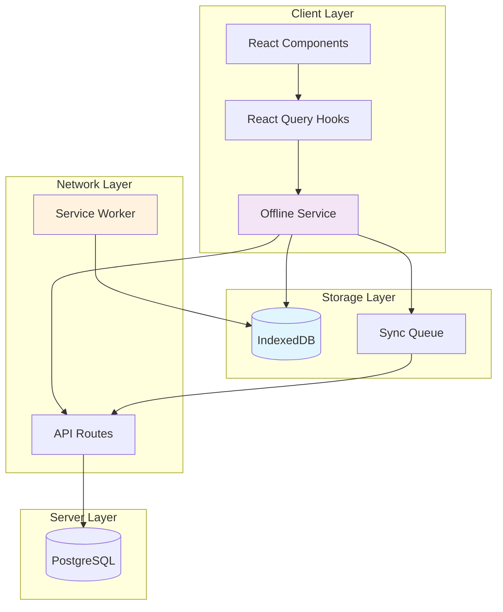
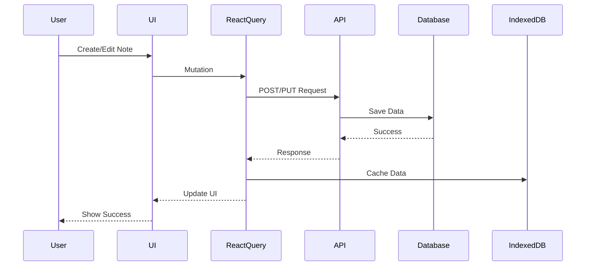
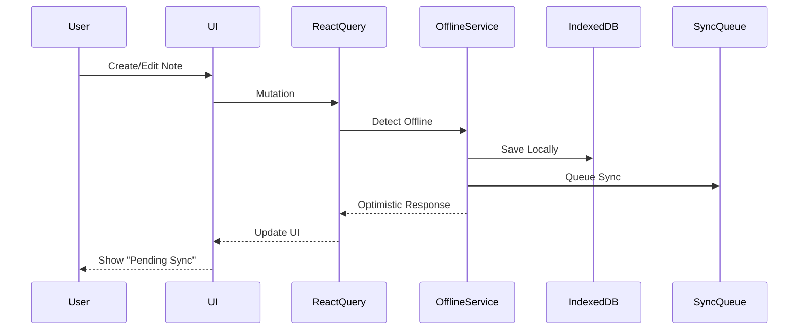
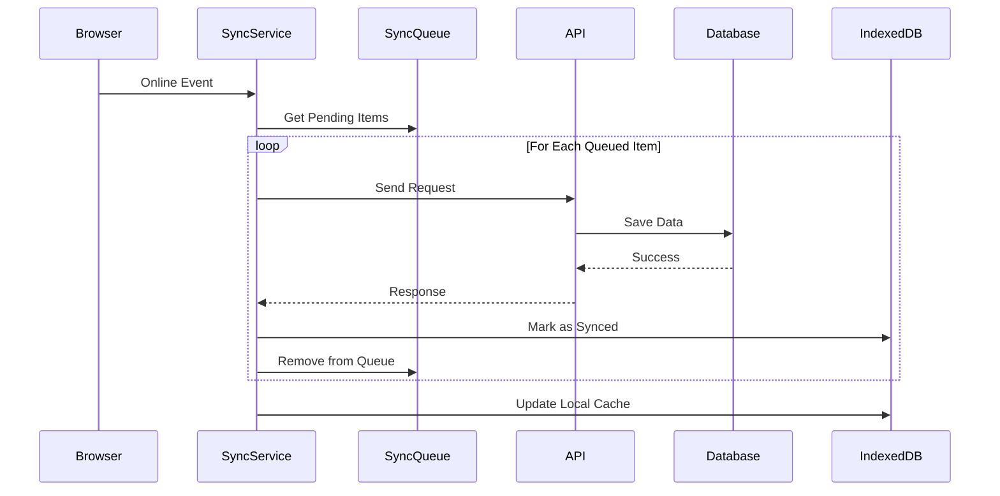

# Wysenote Offline Capability Implementation Plan

> **Project**: Wysenote - AI-Powered Personal Knowledge Base
> **Goal**: Implement true offline capability using PWA technologies
> **Approach**: Based on LogRocket blog methodology with Serwist + IndexedDB
> **Status**: Planning Phase

---

## Executive Summary

This plan outlines the implementation of **true offline capability** for Wysenote, transforming it from a cloud-dependent note-taking app into a fully functional offline-first Progressive Web App (PWA). Based on the LogRocket blog methodology, this implementation will enable users to create, edit, and manage notes without an internet connection, with automatic synchronization when connectivity is restored.

## Current State Analysis

### Existing Architecture

- **Framework**: Next.js 16 with TypeScript
- **Data Fetching**: TanStack Query (React Query) with axios
- **Database**: PostgreSQL with Prisma ORM
- **Authentication**: Clerk
- **Rich Text Editor**: BlockNote
- **Current PWA Support**: Basic manifest.json exists, but no service worker or offline functionality

### Key Observations

1. Already using `--webpack` flag in build script (required for Serwist)
2. Sophisticated auto-save system with debouncing in [`useNoteAutoSave.ts`](hooks/note/useNoteAutoSave.ts:1)
3. Well-structured service layer with transformers and validators
4. React Query hooks for all data operations
5. Complex data model: Notes, Folders, Chat Sessions, Versions, AI features

## Offline Capability Strategy

### App Shell vs True Offline Support

**App Shell Model** (Basic PWA):

- Caches UI assets (HTML, CSS, JS)
- App loads quickly but shows empty states without network
- Suitable for read-only or real-time dependent apps

**True Offline Support** (Our Goal):

- Caches both UI assets AND data
- Users can perform full CRUD operations offline
- Changes queue locally and sync when online
- Suitable for productivity apps like note-taking

### Why True Offline Matters for Wysenote

- **Use Case**: Users need to take notes on planes, in areas with poor connectivity, or during network outages
- **User Experience**: Seamless transition between online/offline states
- **Data Integrity**: No lost work due to connectivity issues
- **Competitive Advantage**: Many note apps fail without internet

## Technical Architecture

### High-Level Architecture Diagram



### Data Flow Patterns

#### Online Mode



#### Offline Mode



#### Sync on Reconnection



## Implementation Plan

### Phase 1: Foundation Setup

#### 1.1 Install Dependencies

```bash
npm install @serwist/next @serwist/precaching @serwist/sw idb
```

**Packages**:

- `@serwist/next`: Next.js integration for service workers
- `@serwist/precaching`: Precaching strategies for app shell
- `@serwist/sw`: Core service worker utilities
- `idb`: IndexedDB wrapper with Promise-based API

#### 1.2 Configure Next.js for PWA

**File**: [`next.config.js`](next.config.js:1)

Update to TypeScript and add Serwist configuration:

```typescript
import type { NextConfig } from "next";
import withSerwistInit from "@serwist/next";

const withSerwist = withSerwistInit({
  swSrc: "app/sw.ts",
  swDest: "public/sw.js",
  cacheOnNavigation: true,
  reloadOnOnline: true,
  disable: process.env.NODE_ENV === "development",
});

const nextConfig: NextConfig = {
  reactStrictMode: true,
  images: {
    remotePatterns: [
      {
        protocol: "https",
        hostname: "images.unsplash.com",
      },
    ],
  },
};

export default withSerwist(nextConfig);
```

**Key Settings**:

- `swSrc`: Location of service worker source
- `swDest`: Where compiled service worker is placed
- `cacheOnNavigation`: Cache pages as user navigates
- `reloadOnOnline`: Refresh when connection restored
- `disable`: Don't cache during development

#### 1.3 Create Service Worker

**File**: `app/sw.ts` (new file)

```typescript
import { defaultCache } from "@serwist/next/worker";
import type { PrecacheEntry, SerwistGlobalConfig } from "serwist";
import { Serwist } from "serwist";

declare global {
  interface WorkerGlobalScope extends SerwistGlobalConfig {
    __SW_MANIFEST: (PrecacheEntry | string)[] | undefined;
  }
}

declare const self: WorkerGlobalScope;

const serwist = new Serwist({
  precacheEntries: self.__SW_MANIFEST,
  skipWaiting: true,
  clientsClaim: true,
  navigationPreload: true,
  runtimeCaching: defaultCache,
});

serwist.addEventListeners();
```

**What This Does**:

- Precaches app shell (HTML, CSS, JS)
- Uses stale-while-revalidate for assets
- Enables immediate activation of new service workers
- Claims all clients immediately

#### 1.4 Update PWA Manifest

**File**: [`public/manifest.json`](public/manifest.json:1)

Convert to TypeScript-generated manifest:

**File**: `app/manifest.ts` (new file)

```typescript
import { MetadataRoute } from "next";

export default function manifest(): MetadataRoute.Manifest {
  return {
    name: "Wysenote - AI-Powered Knowledge Base",
    short_name: "Wysenote",
    description: "AI-powered Personal Knowledge Base that works offline",
    start_url: "/",
    display: "standalone",
    background_color: "#ffffff",
    theme_color: "#1e3a8a",
    orientation: "portrait-primary",
    icons: [
      {
        src: "/icons/icon-light-192.png",
        sizes: "192x192",
        type: "image/png",
        purpose: "any maskable",
      },
      {
        src: "/icons/icon-light-512.png",
        sizes: "512x512",
        type: "image/png",
        purpose: "any maskable",
      },
      {
        src: "/icons/icon-dark-192.png",
        sizes: "192x192",
        type: "image/png",
        purpose: "any",
      },
      {
        src: "/icons/icon-dark-512.png",
        sizes: "512x512",
        type: "image/png",
        purpose: "any",
      },
    ],
    categories: ["productivity", "education", "utilities"],
    shortcuts: [
      {
        name: "New Note",
        short_name: "New Note",
        description: "Create a new note",
        url: "/dashboard?action=new-note",
        icons: [{ src: "/icons/icon-light-192.png", sizes: "192x192" }],
      },
    ],
  };
}
```

### Phase 2: IndexedDB Schema & Utilities

#### 2.1 Database Schema Design

**File**: `lib/db/schema.ts` (new file)

```typescript
export interface DbNote {
  id: string;
  title: string;
  folder_id: string;
  current_version_id: string | null;
  is_pinned: boolean;
  is_deleted: boolean;
  created_at: number;
  updated_at: number;
  synced: boolean;
  sync_version: number; // For conflict resolution
}

export interface DbNoteVersion {
  id: string;
  note_id: string;
  version_number: number;
  rich_text_content: any;
  plain_text_content: string;
  is_published: boolean;
  published_at: number | null;
  created_at: number;
  updated_at: number;
  synced: boolean;
}

export interface DbFolder {
  id: string;
  name: string;
  user_id: string;
  is_deleted: boolean;
  created_at: number;
  updated_at: number;
  synced: boolean;
}

export interface DbChatSession {
  id: string;
  user_id: string;
  scope: "global" | "note" | "folder";
  scope_id: string | null;
  title: string | null;
  created_at: number;
  updated_at: number;
  synced: boolean;
}

export interface DbChatMessage {
  id: string;
  session_id: string;
  role: "user" | "assistant";
  content: string;
  created_at: number;
  synced: boolean;
}

export interface SyncQueueItem {
  id: string;
  entity_type:
    | "note"
    | "note_version"
    | "folder"
    | "chat_session"
    | "chat_message";
  entity_id: string;
  operation: "create" | "update" | "delete";
  data: any;
  created_at: number;
  retry_count: number;
  last_error: string | null;
}

export const DB_NAME = "wysenote-db";
export const DB_VERSION = 1;

export const STORES = {
  NOTES: "notes",
  NOTE_VERSIONS: "note_versions",
  FOLDERS: "folders",
  CHAT_SESSIONS: "chat_sessions",
  CHAT_MESSAGES: "chat_messages",
  SYNC_QUEUE: "sync_queue",
} as const;
```

#### 2.2 IndexedDB Initialization

**File**: `lib/db/index.ts` (new file)

```typescript
import { openDB, IDBPDatabase } from "idb";
import { DB_NAME, DB_VERSION, STORES } from "./schema";

let dbInstance: IDBPDatabase | null = null;

export async function getDB(): Promise<IDBPDatabase> {
  if (dbInstance) return dbInstance;

  dbInstance = await openDB(DB_NAME, DB_VERSION, {
    upgrade(db, oldVersion, newVersion, transaction) {
      // Notes store
      if (!db.objectStoreNames.contains(STORES.NOTES)) {
        const notesStore = db.createObjectStore(STORES.NOTES, {
          keyPath: "id",
        });
        notesStore.createIndex("by-folder", "folder_id");
        notesStore.createIndex("by-synced", "synced");
        notesStore.createIndex("by-updated", "updated_at");
      }

      // Note Versions store
      if (!db.objectStoreNames.contains(STORES.NOTE_VERSIONS)) {
        const versionsStore = db.createObjectStore(STORES.NOTE_VERSIONS, {
          keyPath: "id",
        });
        versionsStore.createIndex("by-note", "note_id");
        versionsStore.createIndex("by-synced", "synced");
      }

      // Folders store
      if (!db.objectStoreNames.contains(STORES.FOLDERS)) {
        const foldersStore = db.createObjectStore(STORES.FOLDERS, {
          keyPath: "id",
        });
        foldersStore.createIndex("by-synced", "synced");
        foldersStore.createIndex("by-user", "user_id");
      }

      // Chat Sessions store
      if (!db.objectStoreNames.contains(STORES.CHAT_SESSIONS)) {
        const chatStore = db.createObjectStore(STORES.CHAT_SESSIONS, {
          keyPath: "id",
        });
        chatStore.createIndex("by-scope", ["scope", "scope_id"]);
        chatStore.createIndex("by-synced", "synced");
      }

      // Chat Messages store
      if (!db.objectStoreNames.contains(STORES.CHAT_MESSAGES)) {
        const messagesStore = db.createObjectStore(STORES.CHAT_MESSAGES, {
          keyPath: "id",
        });
        messagesStore.createIndex("by-session", "session_id");
        messagesStore.createIndex("by-synced", "synced");
      }

      // Sync Queue store
      if (!db.objectStoreNames.contains(STORES.SYNC_QUEUE)) {
        const queueStore = db.createObjectStore(STORES.SYNC_QUEUE, {
          keyPath: "id",
        });
        queueStore.createIndex("by-created", "created_at");
        queueStore.createIndex("by-entity", ["entity_type", "entity_id"]);
      }
    },
  });

  return dbInstance;
}

export async function clearDB(): Promise<void> {
  const db = await getDB();
  const tx = db.transaction(Object.values(STORES), "readwrite");

  await Promise.all([
    ...Object.values(STORES).map((store) => tx.objectStore(store).clear()),
    tx.done,
  ]);
}
```

#### 2.3 CRUD Operations for Notes

**File**: `lib/db/notes.ts` (new file)

```typescript
import { getDB } from "./index";
import { DbNote, DbNoteVersion, STORES } from "./schema";
import { addToSyncQueue } from "./syncQueue";

export async function saveNoteLocally(note: DbNote): Promise<void> {
  const db = await getDB();
  await db.put(STORES.NOTES, note);
}

export async function getNoteLocally(id: string): Promise<DbNote | undefined> {
  const db = await getDB();
  return db.get(STORES.NOTES, id);
}

export async function getAllNotesLocally(): Promise<DbNote[]> {
  const db = await getDB();
  return db.getAll(STORES.NOTES);
}

export async function getNotesByFolderLocally(
  folderId: string,
): Promise<DbNote[]> {
  const db = await getDB();
  return db.getAllFromIndex(STORES.NOTES, "by-folder", folderId);
}

export async function deleteNoteLocally(id: string): Promise<void> {
  const db = await getDB();
  await db.delete(STORES.NOTES, id);
}

export async function saveNoteVersionLocally(
  version: DbNoteVersion,
): Promise<void> {
  const db = await getDB();
  await db.put(STORES.NOTE_VERSIONS, version);
}

export async function getNoteVersionLocally(
  id: string,
): Promise<DbNoteVersion | undefined> {
  const db = await getDB();
  return db.get(STORES.NOTE_VERSIONS, id);
}

export async function getNoteVersionsByNoteIdLocally(
  noteId: string,
): Promise<DbNoteVersion[]> {
  const db = await getDB();
  return db.getAllFromIndex(STORES.NOTE_VERSIONS, "by-note", noteId);
}

export async function getUnsyncedNotes(): Promise<DbNote[]> {
  const db = await getDB();
  return db.getAllFromIndex(STORES.NOTES, "by-synced", 0);
}

export async function markNoteAsSynced(
  id: string,
  syncVersion: number,
): Promise<void> {
  const db = await getDB();
  const note = await db.get(STORES.NOTES, id);
  if (note) {
    note.synced = true;
    note.sync_version = syncVersion;
    await db.put(STORES.NOTES, note);
  }
}
```

#### 2.4 Sync Queue Management

**File**: `lib/db/syncQueue.ts` (new file)

```typescript
import { getDB } from "./index";
import { SyncQueueItem, STORES } from "./schema";

export async function addToSyncQueue(
  item: Omit<SyncQueueItem, "id" | "created_at" | "retry_count" | "last_error">,
): Promise<void> {
  const db = await getDB();
  const queueItem: SyncQueueItem = {
    ...item,
    id: crypto.randomUUID(),
    created_at: Date.now(),
    retry_count: 0,
    last_error: null,
  };
  await db.add(STORES.SYNC_QUEUE, queueItem);
}

export async function getSyncQueue(): Promise<SyncQueueItem[]> {
  const db = await getDB();
  const items = await db.getAllFromIndex(STORES.SYNC_QUEUE, "by-created");
  return items.sort((a, b) => a.created_at - b.created_at);
}

export async function removeFromSyncQueue(id: string): Promise<void> {
  const db = await getDB();
  await db.delete(STORES.SYNC_QUEUE, id);
}

export async function updateSyncQueueItem(
  id: string,
  updates: Partial<SyncQueueItem>,
): Promise<void> {
  const db = await getDB();
  const item = await db.get(STORES.SYNC_QUEUE, id);
  if (item) {
    Object.assign(item, updates);
    await db.put(STORES.SYNC_QUEUE, item);
  }
}

export async function clearSyncQueue(): Promise<void> {
  const db = await getDB();
  await db.clear(STORES.SYNC_QUEUE);
}
```

### Phase 3: Offline Service Layer

#### 3.1 Offline Detection Service

**File**: `lib/offline/onlineStatus.ts` (new file)

```typescript
type OnlineStatusListener = (isOnline: boolean) => void;

class OnlineStatusService {
  private listeners: Set<OnlineStatusListener> = new Set();
  private _isOnline: boolean = true;

  constructor() {
    if (typeof window !== "undefined") {
      this._isOnline = navigator.onLine;
      window.addEventListener("online", this.handleOnline);
      window.addEventListener("offline", this.handleOffline);
    }
  }

  private handleOnline = () => {
    this._isOnline = true;
    this.notifyListeners();
  };

  private handleOffline = () => {
    this._isOnline = false;
    this.notifyListeners();
  };

  private notifyListeners() {
    this.listeners.forEach((listener) => listener(this._isOnline));
  }

  public get isOnline(): boolean {
    return this._isOnline;
  }

  public subscribe(listener: OnlineStatusListener): () => void {
    this.listeners.add(listener);
    return () => this.listeners.delete(listener);
  }

  public destroy() {
    if (typeof window !== "undefined") {
      window.removeEventListener("online", this.handleOnline);
      window.removeEventListener("offline", this.handleOffline);
    }
    this.listeners.clear();
  }
}

export const onlineStatusService = new OnlineStatusService();
```

#### 3.2 Sync Service with Conflict Resolution

**File**: `lib/offline/syncService.ts` (new file)

```typescript
import {
  getSyncQueue,
  removeFromSyncQueue,
  updateSyncQueueItem,
} from "../db/syncQueue";
import { onlineStatusService } from "./onlineStatus";
import axios from "axios";
import { toast } from "sonner";

export type ConflictResolutionStrategy =
  | "server-wins"
  | "client-wins"
  | "last-write-wins";

class SyncService {
  private isSyncing = false;
  private syncInterval: NodeJS.Timeout | null = null;
  private conflictStrategy: ConflictResolutionStrategy = "last-write-wins";

  constructor() {
    if (typeof window !== "undefined") {
      // Listen for online events
      onlineStatusService.subscribe((isOnline) => {
        if (isOnline) {
          console.log("Back online! Starting sync...");
          this.syncAll();
        }
      });

      // Periodic sync every 30 seconds when online
      this.syncInterval = setInterval(() => {
        if (onlineStatusService.isOnline && !this.isSyncing) {
          this.syncAll();
        }
      }, 30000);
    }
  }

  public async syncAll(): Promise<void> {
    if (this.isSyncing || !onlineStatusService.isOnline) {
      return;
    }

    this.isSyncing = true;
    const queue = await getSyncQueue();

    if (queue.length === 0) {
      this.isSyncing = false;
      return;
    }

    console.log(`Syncing ${queue.length} items...`);
    let successCount = 0;
    let failCount = 0;

    for (const item of queue) {
      try {
        await this.syncItem(item);
        await removeFromSyncQueue(item.id);
        successCount++;
      } catch (error) {
        failCount++;
        const errorMessage =
          error instanceof Error ? error.message : "Unknown error";
        console.error(`Sync failed for item ${item.id}:`, errorMessage);

        // Update retry count
        await updateSyncQueueItem(item.id, {
          retry_count: item.retry_count + 1,
          last_error: errorMessage,
        });

        // If too many retries, show error
        if (item.retry_count >= 3) {
          toast.error(`Failed to sync ${item.entity_type} after 3 attempts`);
        }
      }
    }

    this.isSyncing = false;

    if (successCount > 0) {
      toast.success(`Synced ${successCount} item(s)`);
    }
  }

  private async syncItem(item: any): Promise<void> {
    const { entity_type, entity_id, operation, data } = item;

    switch (entity_type) {
      case "note":
        await this.syncNote(entity_id, operation, data);
        break;
      case "note_version":
        await this.syncNoteVersion(entity_id, operation, data);
        break;
      case "folder":
        await this.syncFolder(entity_id, operation, data);
        break;
      case "chat_session":
        await this.syncChatSession(entity_id, operation, data);
        break;
      case "chat_message":
        await this.syncChatMessage(entity_id, operation, data);
        break;
      default:
        throw new Error(`Unknown entity type: ${entity_type}`);
    }
  }

  private async syncNote(
    id: string,
    operation: string,
    data: any,
  ): Promise<void> {
    switch (operation) {
      case "create":
        await axios.post("/api/note", data);
        break;
      case "update":
        await axios.put(`/api/note/${id}`, data);
        break;
      case "delete":
        await axios.put(`/api/note/${id}`, { action: "delete" });
        break;
    }
  }

  private async syncNoteVersion(
    id: string,
    operation: string,
    data: any,
  ): Promise<void> {
    switch (operation) {
      case "create":
      case "update":
        await axios.put(`/api/note/${data.noteId}/version/${id}`, {
          richTextContent: data.rich_text_content,
        });
        break;
    }
  }

  private async syncFolder(
    id: string,
    operation: string,
    data: any,
  ): Promise<void> {
    switch (operation) {
      case "create":
        await axios.post("/api/folder", data);
        break;
      case "update":
        await axios.put(`/api/folder/${id}`, data);
        break;
      case "delete":
        await axios.delete(`/api/folder/${id}`);
        break;
    }
  }

  private async syncChatSession(
    id: string,
    operation: string,
    data: any,
  ): Promise<void> {
    switch (operation) {
      case "create":
        await axios.post("/api/chat", data);
        break;
      case "update":
        await axios.put(`/api/chat/${id}`, data);
        break;
    }
  }

  private async syncChatMessage(
    id: string,
    operation: string,
    data: any,
  ): Promise<void> {
    switch (operation) {
      case "create":
        await axios.post(`/api/chat/${data.sessionId}/message`, data);
        break;
    }
  }

  public destroy() {
    if (this.syncInterval) {
      clearInterval(this.syncInterval);
    }
  }
}

export const syncService = new SyncService();
```

### Phase 4: React Query Integration

#### 4.1 Offline-First Query Client Configuration

**File**: `app/providers.tsx` (update existing)

```typescript
"use client";
import { QueryClient, QueryClientProvider } from "@tanstack/react-query";
import { ReactQueryDevtools } from "@tanstack/react-query-devtools";
import { ClerkProvider } from "@clerk/nextjs";
import { ThemeProvider } from "next-themes";
import { useState, useEffect } from "react";
import { onlineStatusService } from "@/lib/offline/onlineStatus";
import { syncService } from "@/lib/offline/syncService";

export default function Providers({ children }: { children: React.ReactNode }) {
  const [queryClient] = useState(
    () =>
      new QueryClient({
        defaultOptions: {
          queries: {
            // Enable offline support
            networkMode: 'offlineFirst',
            // Retry failed queries when back online
            retry: (failureCount, error) => {
              if (!onlineStatusService.isOnline) return false;
              return failureCount < 3;
            },
            // Stale time for offline caching
            staleTime: 5 * 60 * 1000, // 5 minutes
            // Cache time
            gcTime: 24 * 60 * 60 * 1000, // 24 hours
          },
          mutations: {
            // Enable offline mutations
            networkMode: 'offlineFirst',
            // Retry failed mutations when back online
            retry: (failureCount, error) => {
              if (!onlineStatusService.isOnline) return false;
              return failureCount < 3;
            },
          },
        },
      })
  );

  // Initialize sync service
  useEffect(() => {
    // Trigger initial sync if online
    if (onlineStatusService.isOnline) {
      syncService.syncAll();
    }

    return () => {
      syncService.destroy();
    };
  }, []);

  return (
    <ClerkProvider>
      <QueryClientProvider client={queryClient}>
        <ThemeProvider attribute="class" defaultTheme="system" enableSystem>
          {children}
        </ThemeProvider>
        <ReactQueryDevtools initialIsOpen={false} />
      </QueryClientProvider>
    </ClerkProvider>
  );
}
```

#### 4.2 Offline-Aware Hook Wrapper

**File**: `hooks/useOfflineMutation.ts` (new file)

```typescript
import {
  useMutation,
  useQueryClient,
  UseMutationOptions,
} from "@tanstack/react-query";
import { onlineStatusService } from "@/lib/offline/onlineStatus";
import { addToSyncQueue } from "@/lib/db/syncQueue";
import { syncService } from "@/lib/offline/syncService";

interface OfflineMutationOptions<TData, TError, TVariables>
  extends UseMutationOptions<TData, TError, TVariables> {
  entityType:
    | "note"
    | "note_version"
    | "folder"
    | "chat_session"
    | "chat_message";
  getEntityId: (variables: TVariables) => string;
  getOperation: (variables: TVariables) => "create" | "update" | "delete";
  offlineHandler?: (variables: TVariables) => Promise<TData>;
}

export function useOfflineMutation<TData, TError, TVariables>(
  options: OfflineMutationOptions<TData, TError, TVariables>,
) {
  const queryClient = useQueryClient();
  const {
    entityType,
    getEntityId,
    getOperation,
    offlineHandler,
    ...mutationOptions
  } = options;

  return useMutation<TData, TError, TVariables>({
    ...mutationOptions,
    mutationFn: async (variables) => {
      // If online, use normal mutation
      if (onlineStatusService.isOnline && mutationOptions.mutationFn) {
        return mutationOptions.mutationFn(variables);
      }

      // If offline and handler provided, use offline handler
      if (offlineHandler) {
        const result = await offlineHandler(variables);

        // Queue for sync
        await addToSyncQueue({
          entity_type: entityType,
          entity_id: getEntityId(variables),
          operation: getOperation(variables),
          data: variables,
        });

        return result;
      }

      throw new Error("Offline and no offline handler provided");
    },
    onSuccess: (data, variables, context) => {
      // Trigger sync if online
      if (onlineStatusService.isOnline) {
        syncService.syncAll();
      }

      // Call original onSuccess
      mutationOptions.onSuccess?.(data, variables, context);
    },
  });
}
```

#### 4.3 Update Note Hooks for Offline Support

**File**: `hooks/note/useCreateNoteOffline.ts` (new file)

```typescript
import { useOfflineM
```
