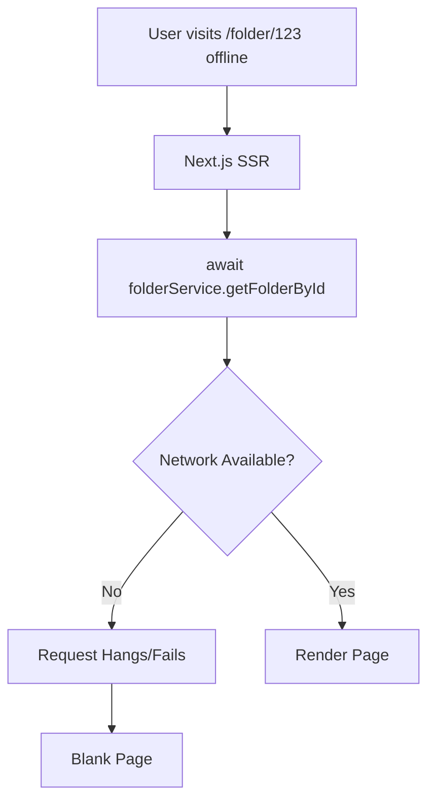
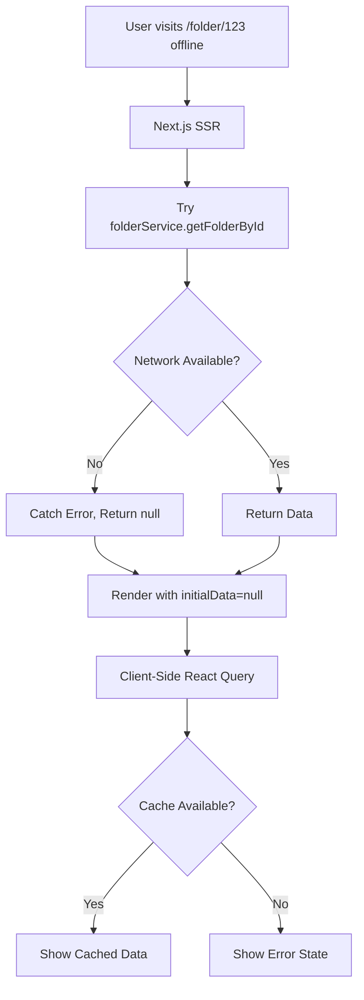

# PWA Offline Fixes - Implementation Plan

## Executive Summary

This document addresses two critical issues with Wysenote's PWA offline functionality:

1. **Mobile offline indicators not showing** - Root cause: Components hidden on mobile ✅ PARTIALLY FIXED
2. **Blank pages when visiting unvisited folders offline** - Root cause: SSR blocking without fallback

## Issue #1: Mobile Offline Indicators

### Root Causes

1. ~~**`PersistentOfflineIndicator`** - Only rendered in `WebSidebar` which is hidden on mobile~~ ✅ FIXED (removed hidden class)
2. **`OfflineModeBanner`** - Has `hidden md:block` class, explicitly hiding on mobile
3. **No mobile layout integration** - Mobile layout has no offline status component

### Solution: Responsive Offline Indicators

#### Files to Modify

**1. `components/web/PersistentOfflineIndicator.tsx`** ✅ ALREADY UPDATED

- Hidden class removed
- Now shows on both mobile and desktop when in sidebar

**2. `components/OfflineModeBanner.tsx`**

```typescript
// REMOVE the wrapper div with "hidden md:block"
// CHANGE FROM:
<div className="hidden md:block">
  <AnimatePresence>
    {/* content */}
  </AnimatePresence>
</div>

// CHANGE TO:
<AnimatePresence>
  {!isOnline && !isDismissed && (
    <motion.div
      initial={{ y: -100, opacity: 0 }}
      animate={{ y: 0, opacity: 1 }}
      exit={{ y: -100, opacity: 0 }}
      // Mobile: bottom-center toast
      // Desktop: top banner
      className="fixed z-[100] bg-amber-500 dark:bg-amber-600 text-white px-4 py-3 shadow-lg
                 md:top-0 md:left-0 md:right-0
                 max-md:bottom-4 max-md:left-1/2 max-md:-translate-x-1/2 max-md:rounded-lg max-md:max-w-[90vw]"
    >
      {/* content unchanged */}
    </motion.div>
  )}
  {/* reconnected banner - same responsive treatment */}
</AnimatePresence>
```

**3. `app/(app)/components/ClientLayoutWrapper.tsx`**

```typescript
import OfflineModeBanner from "@/components/OfflineModeBanner";

export default function ClientLayoutWrapper({ children }) {
  const { showWelcomeDialog, closeWelcomeDialog } = useUpgradeSuccess();

  return (
    <div>
      {/* Add global offline banner - shows on both mobile and desktop */}
      <OfflineModeBanner />

      <MobileHeaderProvider>
        <ResponsiveLayout MobileLayout={MobileLayout} WebLayout={WebLayout}>
          {children}
        </ResponsiveLayout>

        <WelcomeToProDialog
          open={showWelcomeDialog}
          onOpenChange={closeWelcomeDialog}
        />
      </MobileHeaderProvider>
    </div>
  );
}
```

#### Visual Design

**Mobile (< 768px):**

```
┌─────────────────────────────────┐
│                                 │
│         App Content             │
│                                 │
│                                 │
│    ┌─────────────────────┐     │
│    │ 🔌 Offline Mode     │     │ ← Bottom-center toast
│    └─────────────────────┘     │
└─────────────────────────────────┘
```

**Desktop (≥ 768px):**

```
┌─────────────────────────────────┐
│ 🔌 You're offline - Changes...  │ ← Top banner
├──────────┬──────────────────────┤
│ Sidebar  │                      │
│ ┌──────┐ │   App Content        │
│ │Offline│ │                      │ ← Sidebar indicator
│ └──────┘ │                      │
└──────────┴──────────────────────┘
```

---

## Issue #2: Blank Pages When Visiting Unvisited Folders Offline

### Root Causes

1. **Server-Side Rendering blocks** - `await folderService.getFolderById()` fails offline
2. **No client-side fallback** - Page never reaches client to use React Query cache
3. **Service Worker can't help** - SW only handles requests after HTML loads
4. **Aggressive refetch settings** - `staleTime: 0` and `refetchOnMount: true` force fresh fetches

### Current Flow (Broken)



### Solution: Hybrid SSR/CSR Pattern



### Implementation

#### Step 1: Update Server Pages (Non-Blocking SSR)

**Pattern for ALL dynamic pages:**

```typescript
// app/(app)/folder/[id]/page.tsx
// app/(app)/note/[id]/page.tsx
// app/(app)/chat/[id]/page.tsx

export default async function FolderPage({
  params,
}: {
  params: Promise<{ id: string }>;
}) {
  const { id } = await params;

  // Try to fetch server-side, but DON'T block on failure
  let initialFolder = null;
  try {
    const dbUser = await getDbUser();
    const folderService = new FolderService();
    initialFolder = await folderService.getFolderById(id, dbUser.id);
  } catch (error) {
    // Log but don't throw - let client handle it
    console.log('SSR data fetch failed, will use client-side cache');
  }

  // Pass folderId AND initialFolder (which may be null)
  const mobileView = (
    <MobileFolderPageContent
      folderId={id}
      initialFolder={initialFolder}
    />
  );
  const webView = (
    <WebFolderPageContent
      folderId={id}
      initialFolder={initialFolder}
    />
  );

  return <ResponsivePage mobileView={mobileView} webView={webView} />;
}
```

#### Step 2: Update Content Components (Handle Null Initial Data)

**Pattern for ALL content components:**

```typescript
// app/(app)/components/Folder/WebFolderPageContent.tsx
// app/(app)/components/Folder/MobileFolderPageContent.tsx

interface WebFolderPageContentProps {
  folderId: string;              // NEW: Always pass ID
  initialFolder: FolderWithItems | null;  // NEW: Can be null
}

const WebFolderPageContent = ({
  folderId,
  initialFolder
}: WebFolderPageContentProps) => {
  const router = useRouter();
  const [renameOpen, setRenameOpen] = useState(false);
  const [deleteOpen, setDeleteOpen] = useState(false);

  // Use client-side fetching with optional initial data
  const folderData = useGetFolderById(folderId, {
    initialData: initialFolder,
    // REMOVE these overrides - use global defaults:
    // staleTime: 0,           ❌ REMOVE
    // refetchOnMount: true,   ❌ REMOVE
  });

  const renameFolder = useRenameFolder();
  const deleteFolder = useDeleteFolder();

  // Handle loading state
  if (folderData.isLoading) {
    return <FolderPageSkeleton />;
  }

  // Handle error/no data - just show loading skeleton
  // The offline banner will tell users they're offline
  // This avoids false positives for other error types
  if (!folderData.data) {
    return <FolderPageSkeleton />;
  }

  const folder = folderData.data;

  // Separate pinned and unpinned items
  const unpinnedItems = folder.items.filter(
    (item: Note | ChatSession) => !item.is_pinned
  );
  const pinnedItems = folder.items.filter(
    (item: Note | ChatSession) => item.is_pinned
  );

  // Rest of component unchanged...
}
```

#### Step 3: Update React Query Global Defaults

**File: `app/providers.tsx`**

```typescript
function makeQueryClient() {
  return new QueryClient({
    defaultOptions: {
      queries: {
        gcTime: 24 * 60 * 60 * 1000, // 24 hours
        staleTime: 5 * 60 * 1000, // 5 minutes (keep)
        retry: (failureCount, error) => {
          if (typeof navigator !== "undefined" && !navigator.onLine) {
            return false;
          }
          if (error instanceof Error && "status" in error) {
            const status = (error as any).status;
            if (status >= 400 && status < 500) return false;
          }
          return failureCount < 2;
        },
        networkMode: "offlineFirst", // Keep
        refetchOnWindowFocus: false, // Keep
        refetchOnReconnect: true, // Keep
        refetchOnMount: false, // ADD THIS - don't force refetch
      },
      mutations: {
        retry: false,
        networkMode: "online",
      },
    },
  });
}
```

#### Step 4: Remove Aggressive Refetch Overrides

**Search and remove these patterns from ALL page content components:**

```typescript
// FIND AND REMOVE:
staleTime: 0,
refetchOnMount: true,

// In these files:
// - app/(app)/components/Dashboard/WebDashboardContent.tsx
// - app/(app)/components/Dashboard/MobileDashboardContent.tsx
// - app/(app)/components/Folder/WebFolderPageContent.tsx
// - app/(app)/components/Folder/MobileFolderPageContent.tsx
// - app/(app)/components/Note/WebNotePageContent.tsx
// - app/(app)/components/Note/MobileNotePageContent.tsx
// - app/(app)/components/Chat/WebChatPageContent.tsx
// - app/(app)/components/Chat/MobileChatPageContent.tsx
// - app/(app)/components/Chats/WebChatsContent.tsx
// - app/(app)/components/Chats/MobileChatsContent.tsx
// - app/(app)/components/RecentlyDeleted/WebRecentlyDeletedContent.tsx
// - app/(app)/components/RecentlyDeleted/MobileRecentlyDeletedContent.tsx
```

---

## Enhancement: Service Worker API Caching

### Current Service Worker

Your current `app/sw.ts` only uses `defaultCache` which caches:

- Static assets (JS, CSS)
- Navigation requests
- Images

But it does NOT cache API responses.

### Enhanced Service Worker

```typescript
// app/sw.ts - ENHANCED VERSION
import { defaultCache } from "@serwist/next/worker";
import type { PrecacheEntry, SerwistGlobalConfig } from "serwist";
import { Serwist, NetworkFirst, CacheFirst } from "serwist";

declare global {
  interface WorkerGlobalScope extends SerwistGlobalConfig {
    __SW_MANIFEST: (PrecacheEntry | string)[] | undefined;
  }
}

declare const self: WorkerGlobalScope;

const serwist = new Serwist({
  precacheEntries: self.__SW_MANIFEST,
  skipWaiting: true,
  clientsClaim: true,
  navigationPreload: true,
  runtimeCaching: [
    ...defaultCache,

    // NEW: Cache API responses with NetworkFirst strategy
    {
      urlPattern: /^https?:.*\/api\/(folder|note|chat)\/.*/,
      handler: new NetworkFirst({
        cacheName: "api-responses",
        networkTimeoutSeconds: 3, // Try network for 3s, then use cache
        plugins: [
          {
            cacheWillUpdate: async ({ response }) => {
              // Only cache successful GET requests
              if (!response || response.status !== 200) {
                return null;
              }
              return response;
            },
          },
        ],
      }),
    },

    // NEW: Cache images with CacheFirst (faster)
    {
      urlPattern: /\.(?:png|jpg|jpeg|svg|gif|webp|ico)$/,
      handler: new CacheFirst({
        cacheName: "images",
        plugins: [
          {
            cacheWillUpdate: async ({ response }) => {
              return response?.status === 200 ? response : null;
            },
          },
        ],
      }),
    },
  ],

  fallbacks: {
    entries: [
      {
        url: "/offline",
        matcher({ request }) {
          return request.mode === "navigate";
        },
      },
    ],
  },
});

serwist.addEventListeners();
```

### How This Helps

**Before (No API Caching):**

```
User visits /folder/123 (online)
  ↓
API call to /api/folder/123
  ↓
Response NOT cached by SW
  ↓
User goes offline
  ↓
User visits /folder/123 again
  ↓
API call fails (no cache)
  ↓
React Query cache is only hope
```

**After (With API Caching):**

```
User visits /folder/123 (online)
  ↓
API call to /api/folder/123
  ↓
Response cached by SW ✅
  ↓
User goes offline
  ↓
User visits /folder/123 again
  ↓
SW serves cached API response ✅
  ↓
Page loads successfully
```

---

## Optional Enhancement: Smart Data Prefetching

### When to Use

Only implement this if you want to proactively cache data for offline use.

**Pros:**

- All folders available offline immediately
- Better user experience
- No "visit once" requirement

**Cons:**

- Increased initial data load
- Battery/bandwidth usage on mobile
- Cache management complexity

### Implementation

**1. Create Prefetch Hook**

```typescript
// hooks/useDataPrefetch.ts - NEW FILE
import { useEffect } from "react";
import { useQueryClient } from "@tanstack/react-query";
import { useOnlineStatus } from "./useOnlineStatus";
import axios from "axios";

export function useDataPrefetch() {
  const queryClient = useQueryClient();
  const isOnline = useOnlineStatus();

  useEffect(() => {
    if (!isOnline) return;

    async function prefetchData() {
      try {
        // Prefetch folders list
        const folders = await queryClient.fetchQuery({
          queryKey: ["folders"],
          queryFn: async () => {
            const res = await axios.get("/api/folder");
            return res.data;
          },
        });

        // Prefetch each folder's contents (limit to 10 most recent)
        const recentFolders = folders.slice(0, 10);
        await Promise.all(
          recentFolders.map((folder: any) =>
            queryClient.prefetchQuery({
              queryKey: ["folder", folder.id],
              queryFn: async () => {
                const res = await axios.get(`/api/folder/${folder.id}`);
                return res.data;
              },
            }),
          ),
        );

        console.log("Data prefetch complete");
      } catch (error) {
        console.error("Prefetch failed:", error);
      }
    }

    // Prefetch after 2 seconds (don't block initial load)
    const timer = setTimeout(prefetchData, 2000);
    return () => clearTimeout(timer);
  }, [isOnline, queryClient]);
}
```

**2. Use in Layout**

```typescript
// app/(app)/components/ClientLayoutWrapper.tsx
import { useDataPrefetch } from '@/hooks/useDataPrefetch';

export default function ClientLayoutWrapper({ children }) {
  const { showWelcomeDialog, closeWelcomeDialog } = useUpgradeSuccess();

  // Prefetch data when online
  useDataPrefetch();

  return (
    <div>
      <OfflineModeBanner />
      <MobileHeaderProvider>
        <ResponsiveLayout MobileLayout={MobileLayout} WebLayout={WebLayout}>
          {children}
        </ResponsiveLayout>
        <WelcomeToProDialog
          open={showWelcomeDialog}
          onOpenChange={closeWelcomeDialog}
        />
      </MobileHeaderProvider>
    </div>
  );
}
```

---

## Implementation Priority

| Phase                          | Priority    | Files to Change | Impact                  |
| ------------------------------ | ----------- | --------------- | ----------------------- |
| **Phase 1: Mobile Indicators** | 🔴 Critical | 2 files         | Immediate user feedback |
| **Phase 2: Fix Blank Pages**   | 🔴 Critical | ~15 files       | Core functionality      |
| **Phase 3: SW API Caching**    | 🟡 High     | 1 file          | Performance boost       |
| **Phase 4: Data Prefetching**  | 🟢 Optional | 2 files         | Enhanced UX             |

### Recommended Order

1. **Start with Phase 1** (30 minutes)

   - Quick win
   - Immediate user-facing improvement
   - Low risk

2. **Then Phase 2** (2-3 hours)

   - Most important fix
   - Solves the blank page issue
   - Requires careful testing

3. **Add Phase 3** (30 minutes)

   - Easy enhancement
   - Significant performance improvement
   - Low risk

4. **Consider Phase 4** (1 hour)
   - Only if you want proactive caching
   - Test battery/bandwidth impact
   - May not be necessary with Phase 2+3

---

## Testing Checklist

### Phase 1: Mobile Indicators

- [ ] Open app on mobile device
- [ ] Turn on airplane mode
- [ ] Verify bottom-center toast appears
- [ ] Verify toast is dismissible
- [ ] Turn off airplane mode
- [ ] Verify "reconnected" message shows
- [ ] Test on iOS Safari
- [ ] Test on Chrome mobile
- [ ] Test on Android

### Phase 2: Blank Pages

- [ ] Visit folder page while online
- [ ] Go offline (airplane mode)
- [ ] Refresh page - should load from cache
- [ ] Visit NEW folder page while offline
- [ ] Should show "not available offline" message
- [ ] Go back online
- [ ] Verify page loads and syncs
- [ ] Repeat for note pages
- [ ] Repeat for chat pages

### Phase 3: Service Worker

- [ ] Open DevTools > Application > Cache Storage
- [ ] Verify "api-responses" cache exists
- [ ] Visit folder page
- [ ] Check cache contains API response
- [ ] Go offline
- [ ] Verify cached response is used
- [ ] Check network timeout (3s)

### Phase 4: Prefetching

- [ ] Open app while online
- [ ] Wait 2 seconds
- [ ] Check DevTools > Network
- [ ] Verify prefetch requests made
- [ ] Check React Query DevTools
- [ ] Verify data in cache
- [ ] Go offline
- [ ] Visit prefetched folders
- [ ] Should load instantly

---

## Mobile-Specific Considerations

### iOS Safari Limitations

**Service Workers:**

- Only work when app is "Add to Home Screen"
- Cache storage limit: ~50MB
- Background sync NOT supported
- Push notifications NOT supported

**Recommendations:**

1. Add "Add to Home Screen" prompt for iOS users
2. Monitor cache size and implement cleanup
3. Don't rely on background sync
4. Test thoroughly on real iOS devices

### Android Chrome

**Service Workers:**

- Full support in browser and PWA
- Cache storage limit: ~100MB+
- Background sync supported
- Push notifications supported

**Recommendations:**

1. Works great out of the box
2. Consider background sync for mutations
3. Test on various Android versions

---

## Cache Management Strategy

### Current Cache Settings

```typescript
// React Query
gcTime: 24 * 60 * 60 * 1000,  // 24 hours
staleTime: 5 * 60 * 1000,      // 5 minutes

// Service Worker
// No explicit expiration (relies on browser limits)
```

### Recommendations

**For Read-Only Offline:**

- Current settings are good
- 24-hour cache is reasonable
- 5-minute stale time balances freshness and offline

**For Future Full Offline:**

- Implement cache versioning
- Add manual cache clear option
- Monitor cache size
- Implement LRU eviction

---

## Troubleshooting Guide

### Issue: Offline indicators still not showing on mobile

**Check:**

1. Is `OfflineModeBanner` imported in `ClientLayoutWrapper`?
2. Did you remove `hidden md:block` wrapper?
3. Are responsive classes correct?
4. Check browser console for errors
5. Verify `useOnlineStatus` hook is working

**Debug:**

```typescript
// Add to OfflineModeBanner
console.log("isOnline:", isOnline);
console.log("isDismissed:", isDismissed);
```

### Issue: Pages still blank offline

**Check:**

1. Did you update ALL page.tsx files?
2. Did you update ALL content components?
3. Did you remove `staleTime: 0` overrides?
4. Is React Query cache working?
5. Check browser console for errors

**Debug:**

```typescript
// Add to page.tsx
console.log("SSR initialData:", initialFolder);

// Add to content component
console.log("folderData:", folderData);
console.log("isLoading:", folderData.isLoading);
console.log("error:", folderData.error);
```

### Issue: Service Worker not caching API responses

**Check:**

1. Is SW registered? (DevTools > Application > Service Workers)
2. Is SW active?
3. Did you rebuild after changing sw.ts?
4. Check cache storage (DevTools > Application > Cache Storage)
5. Verify API URL pattern matches

**Debug:**

```typescript
// Add to sw.ts
console.log("SW: Caching API response:", request.url);
```

---

## Performance Considerations

### Bundle Size Impact

| Addition               | Size     | Impact             |
| ---------------------- | -------- | ------------------ |
| Responsive classes     | ~0KB     | None (Tailwind)    |
| Error state components | ~2KB     | Minimal            |
| SW API caching         | ~0KB     | None (SW separate) |
| Prefetch hook          | ~1KB     | Minimal            |
| **Total**              | **~3KB** | **Negligible**     |

### Runtime Performance

**Before:**

- SSR blocks on network failure
- No API response caching
- Aggressive refetching

**After:**

- SSR fails gracefully
- API responses cached
- Smart refetching
- **Result: Faster perceived performance**

### Network Usage

**Without Prefetching:**

- Only fetches when user navigates
- Minimal bandwidth usage
- ✅ Recommended for mobile

**With Prefetching:**

- Fetches 10 folders on load
- ~50-100KB additional data
- ⚠️ Consider user's data plan

---

## Next Steps

1. **Review this plan** with your team
2. **Start with Phase 1** (mobile indicators)
3. **Test thoroughly** on real devices
4. **Implement Phase 2** (fix blank pages)
5. **Add Phase 3** (SW caching)
6. **Consider Phase 4** (prefetching) based on user feedback

## Questions?

Common questions answered:

**Q: Will this work on iOS?**
A: Yes, but users must "Add to Home Screen" for full PWA features.

**Q: Do I need IndexedDB?**
A: Not for read-only offline. React Query + SW caching is sufficient.

**Q: What about offline editing?**
A: That's a separate project. This plan focuses on read-only offline access.

**Q: How do I test offline?**
A: Use Chrome DevTools > Network > Offline, or airplane mode on mobile.

**Q: Will this increase my bundle size?**
A: Minimal impact (~3KB). Service Worker is separate from main bundle.
