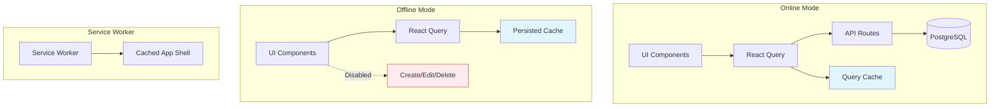

# Wysenote Read-Only Offline Mode - Simplified Implementation Plan

> **Goal**: Enable users to view their notes offline without the complexity of full offline CRUD operations  
> **Effort**: 4-6 hours  
> **Approach**: App shell caching + React Query persistence + Read-only mode when offline

---

## Overview

This simplified approach provides **read-only offline access** to Wysenote content. Users can:

- ✅ View all previously loaded notes
- ✅ Browse folders and navigation
- ✅ Search cached content
- ✅ Fast app loading on repeat visits
- ❌ Cannot create/edit/delete when offline (graceful degradation)

## Why This Approach?

**Benefits**:

- 🎯 Solves the core use case: reading your own notes
- ⚡ Much simpler than full offline sync
- 🔒 No data loss risk (no offline writes)
- 🚀 Quick to implement (4-6 hours vs weeks)
- 💪 Leverages React Query's built-in caching

**Tradeoffs**:

- Users can't edit offline (acceptable for most use cases)
- Requires online connection for first visit
- No sync queue complexity needed

## Architecture



## Implementation Steps

### Step 1: Install Dependencies

```bash
npm install @serwist/next @serwist/precaching @serwist/sw
```

**Why only Serwist?**

- No `idb` needed (React Query handles caching)
- No IndexedDB schema needed
- No sync queue needed

### Step 2: Configure Next.js for PWA

**File**: `next.config.js` → Convert to `next.config.ts`

```typescript
import type { NextConfig } from "next";
import withSerwistInit from "@serwist/next";

const withSerwist = withSerwistInit({
  swSrc: "app/sw.ts",
  swDest: "public/sw.js",
  cacheOnNavigation: true,
  reloadOnOnline: true,
  disable: process.env.NODE_ENV === "development",
});

const nextConfig: NextConfig = {
  reactStrictMode: true,
  images: {
    remotePatterns: [
      {
        protocol: "https",
        hostname: "images.unsplash.com",
      },
    ],
  },
};

export default withSerwist(nextConfig);
```

### Step 3: Create Service Worker

**File**: `app/sw.ts` (new file)

```typescript
import { defaultCache } from "@serwist/next/worker";
import type { PrecacheEntry, SerwistGlobalConfig } from "serwist";
import { Serwist } from "serwist";

declare global {
  interface WorkerGlobalScope extends SerwistGlobalConfig {
    __SW_MANIFEST: (PrecacheEntry | string)[] | undefined;
  }
}

declare const self: WorkerGlobalScope;

const serwist = new Serwist({
  precacheEntries: self.__SW_MANIFEST,
  skipWaiting: true,
  clientsClaim: true,
  navigationPreload: true,
  runtimeCaching: defaultCache,
});

serwist.addEventListeners();
```

**What this does**:

- Caches app shell (HTML, CSS, JS, fonts)
- Uses stale-while-revalidate for assets
- Network-first for API calls (with cache fallback)

### Step 4: Update PWA Manifest

**File**: `app/manifest.ts` (new file)

```typescript
import { MetadataRoute } from "next";

export default function manifest(): MetadataRoute.Manifest {
  return {
    name: "Wysenote - AI-Powered Knowledge Base",
    short_name: "Wysenote",
    description: "AI-powered Personal Knowledge Base - View your notes offline",
    start_url: "/",
    display: "standalone",
    background_color: "#ffffff",
    theme_color: "#1e3a8a",
    orientation: "portrait-primary",
    icons: [
      {
        src: "/icons/icon-light-192.png",
        sizes: "192x192",
        type: "image/png",
        purpose: "any maskable",
      },
      {
        src: "/icons/icon-light-512.png",
        sizes: "512x512",
        type: "image/png",
        purpose: "any maskable",
      },
      {
        src: "/icons/icon-dark-192.png",
        sizes: "192x192",
        type: "image/png",
        purpose: "any",
      },
      {
        src: "/icons/icon-dark-512.png",
        sizes: "512x512",
        type: "image/png",
        purpose: "any",
      },
    ],
    categories: ["productivity", "education", "utilities"],
  };
}
```

**Update**: `app/layout.tsx`

Add manifest reference:

```typescript
export const metadata: Metadata = {
  // ... existing metadata
  manifest: "/manifest.webmanifest",
  appleWebApp: {
    capable: true,
    statusBarStyle: "default",
    title: "Wysenote",
  },
};
```

### Step 5: Configure React Query for Offline Caching

**File**: `app/providers.tsx` (update existing)

```typescript
"use client";
import { QueryClient, QueryClientProvider } from "@tanstack/react-query";
import { ReactQueryDevtools } from "@tanstack/react-query-devtools";
import { ClerkProvider } from "@clerk/nextjs";
import { ThemeProvider } from "next-themes";
import { useState } from "react";

export default function Providers({ children }: { children: React.ReactNode }) {
  const [queryClient] = useState(
    () =>
      new QueryClient({
        defaultOptions: {
          queries: {
            // Cache data for 24 hours
            gcTime: 24 * 60 * 60 * 1000,
            // Consider data stale after 5 minutes
            staleTime: 5 * 60 * 1000,
            // Retry failed queries when back online
            retry: (failureCount, error) => {
              if (!navigator.onLine) return false;
              return failureCount < 3;
            },
            // Use cache when offline
            networkMode: 'offlineFirst',
          },
          mutations: {
            // Don't retry mutations when offline
            retry: false,
            networkMode: 'online',
          },
        },
      })
  );

  return (
    <ClerkProvider>
      <QueryClientProvider client={queryClient}>
        <ThemeProvider attribute="class" defaultTheme="system" enableSystem>
          {children}
        </ThemeProvider>
        <ReactQueryDevtools initialIsOpen={false} />
      </QueryClientProvider>
    </ClerkProvider>
  );
}
```

**Key Settings**:

- `gcTime: 24h` - Keep cached data for a full day
- `networkMode: 'offlineFirst'` - Use cache when offline
- `mutations.networkMode: 'online'` - Block mutations when offline

### Step 6: Online/Offline Detection Hook

**File**: `hooks/useOnlineStatus.ts` (new file)

```typescript
"use client";
import { useState, useEffect } from "react";

export function useOnlineStatus() {
  const [isOnline, setIsOnline] = useState(true);

  useEffect(() => {
    // Set initial state
    setIsOnline(navigator.onLine);

    // Listen for online/offline events
    const handleOnline = () => setIsOnline(true);
    const handleOffline = () => setIsOnline(false);

    window.addEventListener("online", handleOnline);
    window.addEventListener("offline", handleOffline);

    return () => {
      window.removeEventListener("online", handleOnline);
      window.removeEventListener("offline", handleOffline);
    };
  }, []);

  return isOnline;
}
```

### Step 7: Offline Status Banner

**File**: `components/OfflineModeBanner.tsx` (new file)

```typescript
'use client';
import { useOnlineStatus } from '@/hooks/useOnlineStatus';
import { WifiOff, Wifi } from 'lucide-react';
import { motion, AnimatePresence } from 'framer-motion';
import { useState, useEffect } from 'react';

export default function OfflineModeBanner() {
  const isOnline = useOnlineStatus();
  const [showReconnected, setShowReconnected] = useState(false);
  const [wasOffline, setWasOffline] = useState(false);

  useEffect(() => {
    if (!isOnline) {
      setWasOffline(true);
    } else if (wasOffline) {
      // Just came back online
      setShowReconnected(true);
      setTimeout(() => {
        setShowReconnected(false);
        setWasOffline(false);
      }, 3000);
    }
  }, [isOnline, wasOffline]);

  return (
    <>
      <AnimatePresence>
        {!isOnline && (
          <motion.div
            initial={{ y: -100, opacity: 0 }}
            animate={{ y: 0, opacity: 1 }}
            exit={{ y: -100, opacity: 0 }}
            className="fixed top-0 left-0 right-0 z-50 bg-amber-500 dark:bg-amber-600 text-white px-4 py-3 shadow-lg"
          >
            <div className="flex items-center justify-center gap-2 max-w-7xl mx-auto">
              <WifiOff className="w-5 h-5" />
              <span className="font-medium">
                You're offline - Viewing cached content (read-only mode)
              </span>
            </div>
          </motion.div>
        )}

        {showReconnected && (
          <motion.div
            initial={{ y: -100, opacity: 0 }}
            animate={{ y: 0, opacity: 1 }}
            exit={{ y: -100, opacity: 0 }}
            className="fixed top-0 left-0 right-0 z-50 bg-green-500 dark:bg-green-600 text-white px-4 py-3 shadow-lg"
          >
            <div className="flex items-center justify-center gap-2 max-w-7xl mx-auto">
              <Wifi className="w-5 h-5" />
              <span className="font-medium">
                Back online! You can now create and edit notes.
              </span>
            </div>
          </motion.div>
        )}
      </AnimatePresence>
    </>
  );
}
```

### Step 8: Disable Mutations When Offline

**File**: `hooks/useOfflineGuard.ts` (new file)

```typescript
'use client';
import { useOnlineStatus } from './useOnlineStatus';
import { toast } from 'sonner';

export function useOfflineGuard() {
  const isOnline = useOnlineStatus();

  const guardMutation = (callback: () => void) => {
    if (!isOnline) {
      toast.error('You're offline', {
        description: 'This action requires an internet connection',
      });
      return;
    }
    callback();
  };

  return { isOnline, guardMutation };
}
```

### Step 9: Update UI Components

**Update Create/Edit Buttons**:

Example for `components/CreateNote.tsx`:

```typescript
'use client';
import { useOfflineGuard } from '@/hooks/useOfflineGuard';
// ... existing imports

export default function CreateNote({ folderId }: CreateNoteProps) {
  const { isOnline, guardMutation } = useOfflineGuard();
  // ... existing code

  const handleCreate = () => {
    guardMutation(() => {
      // existing create logic
    });
  };

  return (
    <Button
      onClick={handleCreate}
      disabled={!isOnline}
      className={!isOnline ? 'opacity-50 cursor-not-allowed' : ''}
    >
      <Plus className="w-4 h-4 mr-2" />
      New Note
      {!isOnline && <span className="ml-2 text-xs">(Offline)</span>}
    </Button>
  );
}
```

**Update Rich Text Editor**:

Make editor read-only when offline in `components/RichTextEditor.tsx`:

```typescript
'use client';
import { useOnlineStatus } from '@/hooks/useOnlineStatus';

export default function RichTextEditor({ ... }) {
  const isOnline = useOnlineStatus();

  return (
    <BlockNoteView
      editor={editor}
      editable={isOnline} // Disable editing when offline
      // ... other props
    />
  );
}
```

### Step 10: Add Offline Indicator to Layout

**File**: `app/(app)/layout.tsx` (update)

```typescript
import OfflineModeBanner from '@/components/OfflineModeBanner';

export default function AppLayout({ children }) {
  return (
    <>
      <OfflineModeBanner />
      {/* existing layout */}
      {children}
    </>
  );
}
```

## Testing Guide

### Manual Testing

1. **Test App Shell Caching**:

   ```bash
   npm run build
   npm start
   ```

   - Visit http://localhost:3000
   - Open DevTools → Application → Service Workers
   - Verify service worker is registered
   - Go offline (Network tab → Offline)
   - Refresh page - should load instantly

2. **Test Read-Only Mode**:

   - While online, browse several notes
   - Go offline
   - Navigate between notes - should work
   - Try to edit a note - should be disabled
   - Try to create a note - should show error

3. **Test Reconnection**:
   - While offline, try to edit
   - Go back online
   - Should show "Back online" banner
   - Edit functionality should work again

### Chrome DevTools Testing

**Service Worker**:

- Application → Service Workers
- Verify "activated and running"
- Check "Update on reload" for development

**Cache Storage**:

- Application → Cache Storage
- Verify precached assets present

**Network**:

- Network tab → Offline checkbox
- Test offline functionality

## File Structure

```
wysenote/
├── app/
│   ├── sw.ts                          # Service worker (NEW)
│   ├── manifest.ts                    # PWA manifest (NEW)
│   ├── providers.tsx                  # Updated with offline config
│   └── (app)/
│       └── layout.tsx                 # Add OfflineModeBanner
├── components/
│   └── OfflineModeBanner.tsx          # Offline status banner (NEW)
├── hooks/
│   ├── useOnlineStatus.ts             # Online/offline detection (NEW)
│   └── useOfflineGuard.ts             # Mutation guard (NEW)
├── next.config.js → next.config.ts    # Convert to TS, add Serwist
└── plans/
    └── read-only-offline-plan.md      # This file
```

## Deployment Checklist

- [ ] Build succeeds with `npm run build --webpack`
- [ ] Service worker registers in production
- [ ] HTTPS enabled (required for PWA)
- [ ] Manifest accessible at `/manifest.webmanifest`
- [ ] Icons present in `/public/icons/`
- [ ] Test on real mobile device
- [ ] Test "Add to Home Screen" on iOS/Android

## Performance Impact

**Bundle Size**:

- Serwist: ~30KB gzipped
- Service worker: Separate file, doesn't affect main bundle
- Total impact: Minimal

**Runtime Performance**:

- Faster repeat visits (cached assets)
- Instant navigation when offline
- No additional database queries

## User Experience

### Online Mode

- ✅ Full functionality
- ✅ Fast loads (cached assets)
- ✅ Normal editing

### Offline Mode

- ✅ View all previously loaded notes
- ✅ Browse folders and navigation
- ✅ Search cached content
- ❌ Create/edit disabled with clear messaging
- ❌ AI features unavailable

### Transition

- 🔔 Clear banner when going offline
- 🔔 Success message when reconnecting
- 🔔 Disabled buttons show "(Offline)" label

## Future Enhancements

If you later want to add write capabilities:

1. **Optimistic Updates** (Medium effort)

   - Add optimistic UI updates
   - Still requires online for persistence
   - Better perceived performance

2. **Full Offline CRUD** (High effort)
   - Refer to comprehensive plans in this directory
   - Add IndexedDB + sync queue
   - Implement conflict resolution

## Success Metrics

- ✅ App loads offline
- ✅ Users can view cached notes
- ✅ Clear offline status indication
- ✅ No errors when offline
- ✅ Smooth online/offline transitions

## Estimated Timeline

- **Setup (1 hour)**: Install Serwist, configure Next.js
- **Service Worker (30 min)**: Create basic SW
- **Manifest (30 min)**: Update PWA manifest
- **React Query (1 hour)**: Configure offline caching
- **UI Components (1.5 hours)**: Banner, guards, disabled states
- **Testing (1 hour)**: Manual testing, fixes
- **Total: 5.5 hours**

## Conclusion

This read-only offline approach provides **80% of the benefit with 20% of the effort** compared to full offline CRUD. It solves the core use case (reading your notes) without the complexity of sync queues and conflict resolution.

Perfect for Wysenote's primary use case where users are mostly online but occasionally need to reference their notes without connectivity.

---

**Ready to implement?** Switch to Code mode and let's build it! 🚀
